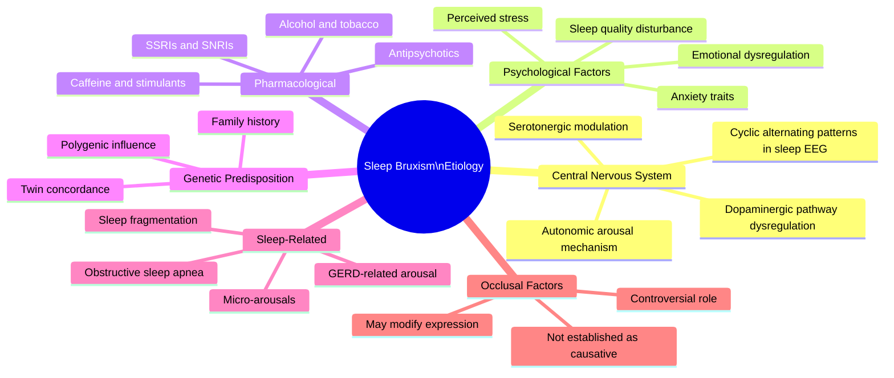
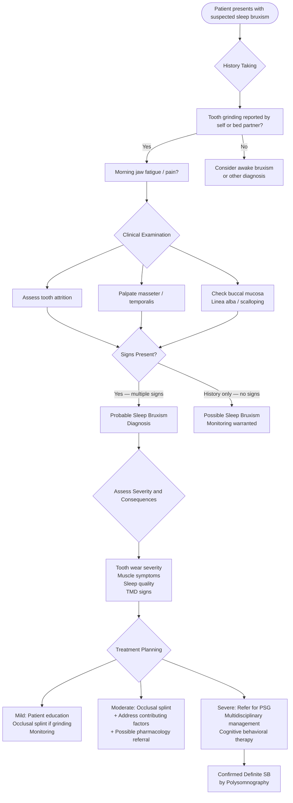

# Sleep Bruxism, OSA, and Tongue Thrust: The Orofacial Myofunctional Cascade

**Target Audience:** General Dentists (Beginner Level)
**Research Focus:** Sleep Bruxism ↔ OSA Bidirectional Relationship; Tongue Thrust → Bruxism Pathway
**Data Sources:** [SciSpace CDP v8.3] — sleep bruxism/OSA relationship (10 papers); tongue thrust/bruxism/OMT (10 papers)
**Document Version:** 2026-04-14 (revised: OSA-bruxism-tongue thrust evidence added)

---

## 1. Defining Sleep Bruxism

Sleep bruxism (SB) is defined as a masticatory muscle activity during sleep characterized by rhythmic (phasic) and/or non-rhythmic (tonic) muscle contractions. It is classified as a sleep-related movement disorder by the American Academy of Sleep Medicine (AASM) and is distinct from awake bruxism (AB), which represents a different behavioral phenomenon occurring during wakefulness.

**[SciSpace]** The 2018 international consensus paper by Lobbezoo and colleagues established a unified definition:

> **Sleep Bruxism (SB):** A masticatory muscle activity during sleep that is characterized by rhythmic or non-rhythmic involuntary muscle contractions and is not a movement disorder in otherwise healthy individuals.

This definition deliberately avoids labeling SB as a "disorder" in healthy individuals, recognizing that bruxism exists on a spectrum and that its clinical significance depends on the presence and severity of associated consequences (tooth wear, muscle pain, sleep disruption).

### 1.1 Bruxism vs. Parafunctional Activity

It is important to distinguish SB from other parafunctional oral habits:

| Activity | Timing | Awareness | Control |
|---|---|---|---|
| **Sleep Bruxism** | During sleep | Unconscious | Involuntary |
| **Awake Bruxism (clenching)** | During wakefulness | Often unconscious | Potentially controllable |
| **Awake Bruxism (grinding)** | During wakefulness | Usually conscious | Somewhat controllable |
| **Rhythmic Masticatory Muscle Activity (RMMA)** | During sleep | Unconscious | Involuntary |
| **Oral dyskinesia** | Wakefulness/sleep | Variable | Involuntary (neurological) |

**[SciSpace]** Rhythmic masticatory muscle activity (RMMA) represents the electromyographic manifestation of SB and is detected during sleep studies. Not all RMMA episodes are accompanied by tooth grinding sounds, which explains why patients may be unaware of their bruxism.

---

## 2. Epidemiology and Prevalence

**[SciSpace]** Reported prevalence rates for SB vary considerably depending on the diagnostic method used (self-report vs. polysomnography), the population studied, and the threshold applied:

- **Self-reported prevalence:** Approximately 8–16% of adults report grinding their teeth during sleep
- **Polysomnography-confirmed prevalence:** Approximately 5–8% of adults meet objective criteria for SB
- **Children:** Higher prevalence (~14–20%) with a tendency to diminish with age
- **Adolescents:** Prevalence approximately 10–12%
- **Elderly (>60 years):** Prevalence decreases to approximately 3%

The apparent decrease in prevalence with age may reflect the natural decline in RMMA frequency observed across the lifespan, though confounds including tooth loss and reduced masticatory capacity complicate interpretation.

### 2.1 Sex Distribution

Unlike TMD, sleep bruxism does not show a marked sex predilection. Most population studies report roughly equal prevalence between males and females, or only small, inconsistent sex differences.

### 2.2 Comorbid Conditions

| Comorbidity | Association with SB |
|---|---|
| **Obstructive sleep apnea (OSA)** | RMMA peaks during micro-arousals and respiratory events |
| **Gastroesophageal reflux disease (GERD)** | Possible common arousal mechanism |
| **Anxiety disorders** | Psychological stress increases SB frequency |
| **Major depressive disorder** | Associated; further complicated by pharmacological treatments |
| **ADHD** | Increased bruxism prevalence in ADHD patients |
| **Parkinson's disease** | Increased non-rhythmic (tonic) bruxism |
| **Down syndrome** | Significantly elevated prevalence |

---

## 3. Etiology and Pathophysiology

Sleep bruxism is recognized as multifactorial in origin, with contributions from central neurological mechanisms, psychological factors, genetic predisposition, and exogenous substances.

### 3.1 Central Nervous System Mechanisms

**[SciSpace]** The central origin hypothesis for SB is now well-supported. Key evidence includes:

- SB episodes are tightly linked to **cyclic alternating patterns (CAP)** in sleep EEG, suggesting a central arousal mechanism
- RMMA is associated with **autonomic nervous system activation** (heart rate increase, EEG arousal) preceding muscle contractions by several seconds
- **Dopaminergic system involvement** is implicated: levodopa reduces SB in some patients; dopamine-blocking medications (antipsychotics) may induce bruxism
- **Serotonergic modulation** — selective serotonin reuptake inhibitors (SSRIs) are recognized as a pharmacological risk factor for bruxism

### 3.2 Psychological Factors

**[SciSpace]** Psychological stress and emotional regulation difficulties are consistently identified as contributors to SB:

- Perceived daytime stress correlates with SB episode frequency
- Anxiety traits are associated with elevated RMMA
- Emotional suppression and difficulty with emotional regulation are reported more frequently in SB patients

However, the relationship is correlational, not causative — not all stressed individuals develop bruxism, and SB occurs in the absence of overt psychological pathology.

### 3.3 Pharmacological and Substance Factors

| Substance / Medication | Effect on SB |
|---|---|
| **SSRIs (fluoxetine, sertraline, etc.)** | Strongly associated with increased SB |
| **SNRIs (venlafaxine, duloxetine)** | Associated with increased bruxism |
| **Antipsychotics (typical and atypical)** | Associated with bruxism (dopamine blockade) |
| **Caffeine** | Mild association with increased RMMA |
| **Alcohol** | Mixed evidence; may increase sleep-related arousal |
| **Tobacco smoking** | Associated with increased SB prevalence |
| **Recreational stimulants (MDMA, cocaine, amphetamines)** | Strong association |

> **Clinical Pearl:** Always take a thorough medication history in patients presenting with suspected bruxism. SSRIs and SNRIs are among the most frequently prescribed medications and are a common, underrecognized cause of new-onset or worsened bruxism.

### 3.4 Genetic Factors

**[SciSpace]** Family studies and twin studies suggest a genetic contribution to SB:

- First-degree relatives of SB patients have significantly elevated SB prevalence
- Twin concordance studies suggest moderate heritability
- Specific genetic variants have been investigated but no single causative gene has been identified

---

## 4. Etiology Mindmap



---

## 5. Clinical Consequences of Sleep Bruxism

### 5.1 Dental and Orofacial Consequences

**[SciSpace]** The clinical significance of SB is largely determined by its consequences:

| Consequence | Clinical Features | Severity Indicators |
|---|---|---|
| **Tooth attrition** | Wear on occlusal/incisal surfaces; loss of anatomy | Rate of progression; loss of vertical dimension |
| **Tooth fracture** | Cusp fractures; cracked tooth syndrome | Depth and extent of fracture |
| **Restorative failure** | Fracture of crowns, veneers, implant components | Frequency and pattern of failure |
| **TMJ arthralgia** | Joint pain, particularly on waking | Severity; limitation of function |
| **Masticatory myalgia** | Muscle pain and fatigue, especially in masseter/temporalis | Severity; bilateral vs. unilateral |
| **Sleep disruption** | Audible grinding disturbs bed partner | Bed partner report; own sleep quality |
| **Headache** | Temporal headache on waking | Frequency; severity |

### 5.2 Impact on TMD

**[SciSpace]** The relationship between sleep bruxism and TMD is complex and bidirectional:

- SB is considered a **risk factor for TMD**, particularly for myalgia and TMJ arthralgia, due to sustained muscle loading and joint compression
- However, epidemiological studies show that many individuals with SB do **not** develop TMD, and vice versa
- Central sensitization may mediate the relationship — individuals with heightened pain sensitivity are more likely to develop symptomatic TMD in the presence of bruxism
- SB is consistently identified as a perpetuating factor for TMD once it develops

---

## 6. Diagnostic Criteria

**[SciSpace]** The 2018 international consensus established a hierarchical grading system for SB diagnosis:

### 6.1 Grading System

| Grade | Method | Description |
|---|---|---|
| **Possible SB** | Self-report | Patient/bed partner reports tooth grinding or jaw clenching during sleep |
| **Probable SB** | Clinical examination | Signs of tooth wear, muscle hypertrophy, or reported SB on history; no polysomnography |
| **Definite SB** | Polysomnography (PSG) | PSG-confirmed RMMA during sleep; ≥ 4 RMMA episodes per hour or ≥ 25 RMMA bursts per hour |

### 6.2 Clinical Indicators

For practical clinical diagnosis at the level of "Probable SB," the following indicators are assessed:

**History:**
- Patient or bed partner reports of tooth grinding sounds during sleep
- Morning jaw fatigue or pain
- Morning headache (temporal region)
- Awareness of clenching during sleep (may be reported upon waking)

**Clinical Examination:**

| Finding | Significance |
|---|---|
| **Tooth attrition** | Facets on occlusal/incisal surfaces inconsistent with normal dietary wear |
| **Masseter hypertrophy** | Bilateral enlargement of masseter; prominent on palpation |
| **Temporalis tenderness** | Tenderness on palpation of anterior temporalis |
| **Linea alba** | White horizontal line on buccal mucosa at occlusal level |
| **Scalloping of lateral tongue** | Indentation marks from teeth |
| **Cheek ridging** | Bite marks on buccal mucosa |
| **Tooth sensitivity** | Increased dentinal sensitivity from enamel loss |

> **Clinical Pearl:** No single clinical sign is pathognomonic for SB. Diagnosis is based on the constellation of findings combined with history. Tooth attrition is the most commonly referenced sign, but its cause is multifactorial (diet, erosion, abrasion) and cannot be attributed to bruxism without supporting history.

### 6.3 Portable Monitoring Devices

**[SciSpace]** Several devices are available for ambulatory bruxism monitoring between PSG and clinical assessment:

- **Electromyographic (EMG) devices:** Bruxoff, GrindCare — measure masseter or temporalis EMG during sleep
- **Contingent electrical stimulation devices:** BiteStrip, Grindcare (treatment mode)
- **Acoustic devices:** Detect grinding sounds
- **Intraoral devices with sensors:** Measure bite force during sleep

These devices offer intermediate diagnostic accuracy and may be appropriate for clinical monitoring when PSG is not feasible.

---

## 7. Diagnostic Flowchart



---

## 8. Management Principles

### 8.1 Goals of Management

The primary goals of SB management are:
1. Protect teeth and restorations from further damage
2. Reduce masticatory muscle pain and TMJ symptoms
3. Improve sleep quality
4. Address underlying contributing factors

### 8.2 Occlusal Splint Therapy

**[SciSpace]** The stabilization splint (flat-plane occlusal appliance) is the cornerstone of dental management for SB:

- Protects teeth from attrition and fracture
- May reduce RMMA amplitude (though evidence on frequency reduction is mixed)
- Provides muscle relaxation in some patients
- Should be fabricated on the arch with more teeth to be protected (usually maxillary)
- Follow-up every 3–6 months; inspect for wear through

> **Clinical Pearl:** The occlusal splint does not "cure" bruxism — it is a protective device. Patients should be counseled that the splint protects their teeth but does not eliminate the underlying muscle activity.

### 8.3 Behavioral Interventions

- **Cognitive behavioral therapy (CBT):** Evidence supports efficacy for stress-related bruxism
- **Biofeedback:** EMG or acoustic feedback during sleep shows short-term benefit; long-term efficacy limited
- **Stress reduction techniques:** Mindfulness, relaxation therapy
- **Sleep hygiene counseling:** Regular sleep schedule, avoid stimulants before bed

### 8.4 Pharmacological Options

- **Clonazepam (0.5–1 mg at bedtime):** Some evidence for RMMA reduction; risk of dependence limits long-term use
- **Clonidine:** Alpha-2 agonist; some evidence for RMMA reduction
- **Botulinum toxin (Botox):** Injection into masseters; reduces contraction force; useful for protecting teeth and reducing muscle hypertrophy; does not eliminate bruxism activity
- **Melatonin:** Limited evidence; may have modest benefit

---

## 9. Key Clinical Pearls Summary

> **Pearl 1 — Grade your diagnosis:** Use the Possible / Probable / Definite grading system. "Probable SB" based on history and clinical examination is appropriate for most clinical settings without requiring PSG.

> **Pearl 2 — Screen for OSA:** Patients with SB should be screened for obstructive sleep apnea (OSA), as there is a significant overlap. Unmanaged OSA may perpetuate bruxism through arousal mechanisms. A simple STOP-BANG questionnaire is adequate for initial screening.

> **Pearl 3 — Review medications:** SSRIs and antipsychotics are common contributors to new-onset bruxism. Communicate with the prescribing physician about possible dose adjustment or substitution before pursuing dental interventions.

> **Pearl 4 — Distinguish SB from awake bruxism:** Management strategies differ. Awake bruxism is better addressed through habit reversal and awareness training; SB requires different interventions.

> **Pearl 5 — Monitor children:** SB is common in children and often resolves spontaneously. Aggressive intervention is generally not warranted unless significant tooth structure loss is occurring.

---

## 10. Summary Reference Table

| Feature | Details |
|---|---|
| **Definition** | Masticatory muscle activity during sleep; rhythmic (phasic) and/or tonic |
| **Classification** | Sleep-related movement disorder (AASM) |
| **Prevalence (self-reported)** | ~8–16% of adults |
| **Prevalence (PSG-confirmed)** | ~5–8% of adults |
| **Sex predilection** | None (roughly equal) |
| **Diagnosis gold standard** | Polysomnography (PSG) with audio-video recording |
| **Clinical diagnosis level** | "Probable SB" — history + clinical signs |
| **Key clinical signs** | Tooth attrition, masseter hypertrophy, linea alba |
| **Primary dental management** | Stabilization splint (occlusal appliance) |
| **Relationship to TMD** | Risk factor and perpetuating factor for TMD |
| **Key pharmacological risk** | SSRIs, SNRIs, antipsychotics |

---

## 11. The OSA-Bruxism-Tongue Thrust Triad: Academic Evidence

This section integrates new SciSpace evidence confirming that sleep bruxism is not an isolated parafunctional habit — it is part of the **orofacial myofunctional cascade** central to this research program.

### 11.1 Sleep Bruxism and OSA: Bidirectional Relationship

**[SciSpace]** Systematic review evidence confirms a robust bidirectional relationship between SB and OSA:

- **Bortoletto et al. (Systematic Review — "Sleep Apnea–Hypopnea Syndrome and Sleep Bruxism"):** Analyzed the pathophysiological relationship, shared risk factors, and common clinical signs between SB and SAHS. Concluded that SB episodes are temporally associated with respiratory events — RMMA (rhythmic masticatory muscle activity) peaks during micro-arousals triggered by hypoxic events.

- **PSG-based study:** Confirmed that OSA is the most common sleep disorder, and SB commonly co-occurs with OSA. The temporal relationship shows: apnea event → arousal → RMMA episode → SB grinding. This means **OSA is mechanistically upstream of SB** in many patients.

- **Review on mutually interacting conditions (OSA + SB + GERD):** Documents that obstructive sleep apnea, sleep bruxism, and gastroesophageal reflux share a common arousal-based mechanism — each condition perpetuates the others through sleep fragmentation and sympathetic activation.

**Clinical implication:** When a patient presents with SB and has undiagnosed OSA, treating bruxism with an occlusal splint alone addresses only the dental consequence, not the upstream apneic driver. **Screening for OSA is mandatory in every SB patient.**

### 11.2 Tongue Thrust and Bruxism: The Direct Connection

**[SciSpace]** The most recent international consensus on bruxism (Lobbezoo et al., updated definition) includes **mandibular thrusting** in the definition of bruxism:

> **Bruxism:** A masticatory muscle activity during sleep OR wakefulness characterized by rhythmic or non-rhythmic muscle contractions, including **clenching, grinding, bracing, or thrusting** of the mandible.

The explicit inclusion of **mandibular thrusting** directly connects tongue thrust/jaw thrust behaviors to the bruxism spectrum. The "thrusting" component may represent the adult persistence of an infantile jaw-protrusion pattern during the swallowing act — making it mechanistically continuous with tongue thrust.

**[SciSpace]** Mozzanica et al.'s OMT study for tongue thrust documented that OMT not only improves tongue strength and swallowing pattern, but also reduces **associated parafunctional behaviors** — consistent with the view that tongue thrust and bruxism/jaw-thrusting share orofacial myofunctional origins.

**[SciSpace]** A scoping review on OMT for atypical swallowing identified that the therapeutic exercise programs used for tongue thrust correction overlap substantially with programs that reduce orofacial parafunctional activity — providing indirect but consistent support for the tongue thrust–bruxism functional connection.

### 11.3 The Three-Way Pathway

The complete orofacial myofunctional cascade, supported by the SciSpace evidence above:

```
Retained tongue thrust (infantile swallowing pattern)
              ↓
Low tongue resting posture + oropharyngeal muscle hypotonia
              ↓
Narrowed palate + mandibular retrognathia + reduced airway space
              ↓
  ┌───────────────────────────┐
  ↓                           ↓
OSA (airway obstruction    Jaw thrusting / bruxism
  during sleep)              (compensatory RMMA)
  ↓                           ↓
  └──────────────────┬────────┘
                     ↓
              Arousal-based SB episodes
              (apnea → arousal → RMMA)
                     ↓
              Tooth attrition + cervical stress
              (NCCLs, cuspal wear, TMD symptoms)
```

**OMT addresses the cascade at the root:** By restoring nasal breathing, elevating tongue resting posture, and establishing mature swallowing patterns, OMT reduces the airway-vulnerability that drives both OSA and the bruxism it triggers.

### 11.4 Management Implications

| Finding | Action Required |
|---------|----------------|
| SB + suspected OSA | Sleep study before finalizing bruxism management |
| SB + tongue thrust signs | OMT referral; address root cause, not just dental consequence |
| SB + open bite / narrow arch | Orthodontic + OMT collaboration |
| SB + ankyloglossia | Frenotomy assessment before OMT (if OSA component present) |
| SB + medication exposure | Communicate with prescriber; rule out pharmacological cause |

---

## 12. References (OSA-Bruxism-Tongue Thrust Section)

**Elicit E-Q10 sources (PSG studies + systematic reviews):**

1. Hosoya A et al. (2014) — Relationship between sleep bruxism and sleep respiratory events in OSA patients. *Sleep and Breathing*. **OR=3.96 (95%CI 1.03–15.20)**. DOI: 10.1007/s11325-013-0880-5
2. Martynowicz H et al. (2019) — The Evaluation of the Relationship between OSA and Sleep Bruxism. *Journal of Clinical Medicine*. n=110 PSG; BEI 5.50±4.58 (mild-moderate OSA) vs 1.62±1.28 (severe OSA), p<0.05. DOI: 10.3390/jcm8101310
3. Li D et al. (2022) — Clinical Features of Sleep Bruxism in Patients with OSA. *Journal of Clinical Sleep Medicine*. n=914; SB prevalence **49.7%**; 85.7% RMMA associated with arousals. DOI: 10.5664/jcsm.9892
4. Dadphan A et al. (2024) — Prevalence of Sleep Bruxism and Effect of Positive Airway Pressure on SB. *Sleep and Breathing*. n=100; **PAP → BEI 5.5 → 0 (p<0.001)**.
5. Pauletto P et al. (2022) — Sleep bruxism and OSA: A scoping review. *Sleep*. Co-occurrence: adults **39.3%**, children **26.1%**. DOI: 10.1093/sleep/zsac105
6. Marcjasz G et al. (2025) — SB in OSA: SB present in 1/3–1/2 of OSA patients; OSA = independent SB risk factor.
7. Lavigne GJ et al. (2007) — Sleep Bruxism international consensus (includes **mandibular thrusting** in definition). *Archives of Oral Biology*.

**SciSpace CDP sources (sleep bruxism/OSA + tongue thrust queries, 20 papers):**

8. Mozzanica F et al. — Impact of OMT on Orofacial Myofunctional Status and Tongue Strength. DOI: 10.1159/000510908
9. Inostroza-Allende F et al. — Myofunctional Therapy in Atypical Swallowing: A Scoping Review. DOI: 10.3390/ijom51020010

---

*Document prepared for educational purposes based on [SciSpace CDP v8.3] literature database. Clinical decisions should be made in the context of individual patient assessment and current best-practice guidelines.*
