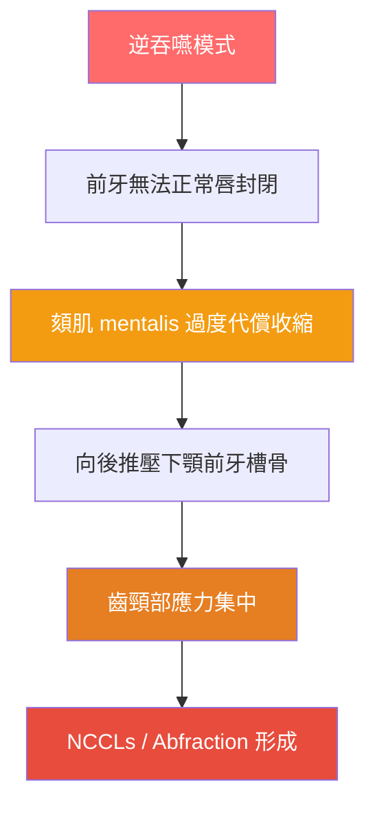

# 齒頸部磨耗與逆吞嚥肌力：多因子病因與預防保健方向

<!-- 註記-META-001：探討非齲性齒頸部病損（NCCLs）的多因子病因，聚焦逆吞嚥異常肌力對齒頸磨耗的貢獻，並提出根本性預防策略 -->

> **文件版本**：v1.0
> **建立日期**：2026-04-14
> **參考規格**：[[SPEC-01_知識管理系統總覽與架構規格]]
> **目標讀者**：牙醫師、口腔肌功能治療師、早期矯正相關臨床人員
> **狀態**：draft

---

## 大綱與摘要

<!-- 註記-SEC-001 -->

### 文件大綱

| 章節 | 主題 | 學習目標 |
|:----:|------|---------|
| 一 | NCCLs 多因子病因概述 | 理解齒頸磨耗的複合成因，跳脫「刷牙太大力」單因子思維 |
| 二 | 逆吞嚥異常肌力的關鍵數字 | 掌握 FEA 研究數據，量化逆吞嚥對齒頸的應力貢獻 |
| 三 | 頻率累積效應 | 比較刷牙 vs 吞嚥的累積傷害差距 |
| 四 | 研究現況與知識缺口 | 了解現有文獻局限，辨識未來研究方向 |
| 五 | 預防保健方向 | 建立根本性介入 + 輔助保護的臨床行動框架 |

<!-- 註記-TBL-001：文件大綱對照表 -->

### 摘要

<!-- 註記-SUM-001 -->
逆吞嚥產生的唇周肌異常應力（18.39 MPa）為正常吞嚥的 7.4 倍，加上每日 600–2000 次的吞嚥頻率，對齒頸部的累積傷害遠超刷牙。預防應從口腔肌功能治療（OMT）根本矯正，輔以低研磨牙膏與壓力感測牙刷。

---

## 一、NCCLs 多因子病因概述

<!-- 註記-SEC-002 -->

非齲性齒頸部病損（Non-Carious Cervical Lesions, **NCCLs**）早已被公認為**多因子交互作用**的結果。傳統臨床教育長期強調「刷牙太大力」，卻大幅低估了口腔肌功能異常（Oral Myofunctional Disorders, **OMD**）的貢獻。

根據 2025 年系統性文獻回顧，NCCLs 的成因涵蓋以下四大機制：

| 機制 | 英文術語 | 說明 | 主要來源 |
|------|---------|------|---------|
| **磨耗** | Abrasion | 機械摩擦導致的牙質損失 | 刷牙、食物 |
| **侵蝕** | Erosion | 酸性物質溶解牙質 | 飲食、胃食道逆流 |
| **折斷** | Abfraction | 咬合應力導致齒頸疲勞性裂損 | 夜磨牙、異常肌力 |
| **應力腐蝕** | Stress Corrosion | 應力與化學侵蝕協同作用 | 複合多因子 |

<!-- 註記-TBL-002：NCCLs 四大成因比較表 -->

> [!important] 刷牙力的真實閾值
> 建議刷牙力 ≤ 1 N；需達 4 N 高研磨性牙膏才造成顯著磨耗。

---

## 二、逆吞嚥異常肌力：關鍵 FEA 數據

<!-- 註記-SEC-003 -->

2023 年一項發表於 PMC 的**有限元素分析研究**（Finite Element Analysis, **FEA**）直接比較了正常與異常吞嚥模式下，唇周肌肉對下頜牙槽骨的 Von Mises 應力值：

| 吞嚥狀態 | Von Mises 最高應力 | 相對倍數 |
|---------|-----------------|---------|
| **正常吞嚥**（唇肌正常功能） | 2.469 MPa | 1× 基準值 |
| **逆吞嚥**（mentalis 過度收縮） | 18.39 MPa | **7.4 倍** |

<!-- 註記-TBL-003：正常 vs 逆吞嚥應力比較表 -->

逆吞嚥（或稱異常吞嚥模式）的力學路徑如下：前牙無法形成正常唇封閉 → **頦肌（mentalis）** 及其他表情肌過度代償收縮 → 向後推壓下顎前牙槽骨 → 應力集中於**齒頸部**，與 abfraction 生物力學機制高度吻合。

> [!important] 7.4 倍應力差異
> 逆吞嚥產生的唇周肌應力是正常吞嚥的 7.4 倍，遠超任何刷牙力道所能造成的應力水準。

<!-- 註記-FLW-001：逆吞嚥導致齒頸磨耗的力學路徑圖 -->

---

## 三、頻率累積效應：更驚人的傷害差距

<!-- 註記-SEC-004 -->

單次應力的高低只是問題的一半；**頻率累積**才是真正決定累積傷害量的關鍵變數。

| 行為 | 每日時間/次數 | 累積傷害評估 |
|------|------------|------------|
| **刷牙** | 約 4 分鐘（2 次 × 2 分鐘） | 有限，可量化控制 |
| **吞嚥（正常）** | 600–2000 次/天（含睡眠） | 低單次應力 × 高頻次 |
| **吞嚥（逆吞嚥）** | 600–2000 次/天 × 7.4 倍應力 | **累積傷害遠超刷牙** |

<!-- 註記-TBL-004：刷牙 vs 吞嚥累積傷害比較表 -->

研究亦指出，異常吞嚥患者中，**唇壓（lip pressure）** 是超出正常參考值最顯著的指標，可作為臨床快速篩查的重要線索。

> [!important] 頻次倍數效應
> 即便每次逆吞嚥的單一力量低於用力刷牙，在 600–2000 次/天的頻率下，整體齒頸累積應力仍遠高於刷牙的貢獻。

---

## 四、研究現況與知識缺口

<!-- 註記-SEC-005 -->

目前學術界對逆吞嚥與 NCCLs 的直接因果關係研究仍處於**起步階段**，現有文獻主要包含三類：

| 文獻類型 | 代表研究 | 貢獻與限制 |
|---------|---------|-----------|
| **FEA 力學模型** | 2023 年 PMC 研究 | 量化應力差異，但為模擬數據 |
| **肌電圖（EMG）研究** | 異常吞嚥患者研究 | 證實唇周肌過度活化，但未連結 NCCLs |
| **相關性研究** | OMD 與牙列異常文獻 | 間接佐證，缺乏縱貫設計 |

<!-- 註記-TBL-005：現有文獻類型與限制比較表 -->

**最重要的研究缺口**：目前尚無研究以 NCCLs 的深度/進展速度為主要結果，直接比較矯正逆吞嚥前後的差異。這是最具臨床說服力、也最值得深入的研究方向。

[補-1] 建議設計縱貫性臨床研究：以接受 OMT 矯正逆吞嚥的患者為介入組，追蹤 NCCLs 的進展速度，對照未介入組，建立直接因果證據。

[補-2] 可結合 3D 齒質磨耗測量（如口內掃描重疊分析）與肌電圖，同步量化吞嚥模式改善與齒頸磨耗減緩的相關性。

---

## 五、預防保健方向

<!-- 註記-SEC-006 -->

若接受逆吞嚥為 NCCLs 的重要致病因子，預防策略應分為**根本性介入（治因）** 與**輔助性保護**兩個層次：

### 根本性介入（治因）

| 介入方式 | 目標 | 最佳時機 |
|---------|------|---------|
| **口腔肌功能治療（OMT/FuCT）** | 訓練正確舌位抬高、建立完整唇封閉，根本矯正吞嚥模式 | 任何年齡，越早越好 |
| **早期篩查兒童逆吞嚥** | 學齡前至混合齒列期介入，同時預防 NCCLs 與咬合發育異常 | 混合齒列期（6–12歲） |
| **頸姿與舌骨肌群評估** | 前傾頭姿（Forward Head Posture）誘發舌骨下肌群緊繃，進一步觸發異常吞嚥 | 配合 OMT 一併處理 |

<!-- 註記-TBL-006：根本性介入方式比較表 -->

### 輔助性保護

| 保護措施 | 建議規格 | 說明 |
|---------|---------|------|
| **壓力感測電動牙刷** | 刷牙力 ≤ 1 N | 避免機械磨耗疊加 |
| **低研磨性牙膏** | RDA < 70 + 軟毛牙刷 | 降低磨耗協同效應 |
| **夜間磨牙評估** | PSG 或磨牙偵測貼片 | NCCLs 與夜磨牙常同步出現 |
| **定期追蹤 NCCLs** | 每 6 個月口內掃描比對 | 避免過早填補而忽略病因矯正 |

<!-- 註記-TBL-007：輔助性保護措施比較表 -->

> [!important] 不要只補牙，要矯正病因
> NCCLs 若未先處理逆吞嚥根因，過早進行樹脂填補後仍會持續磨耗，應優先完成 OMT 再評估修復時機。

[補-3] 建議建立診所內的逆吞嚥快速篩查表（含唇壓測量、舌位靜止位觀察、吞嚥時唇部代償動作視診），作為常規初診評估的一部分。

---

## 重要提示字句

<!-- 註記-SEC-TIPS -->

> [!important] 7.4 倍應力差異
> 逆吞嚥（mentalis 過度收縮）產生的應力為正常吞嚥的 7.4 倍（18.39 vs 2.469 MPa）。

> [!important] 頻率是傷害的乘數
> 600–2000 次/天的吞嚥頻率，讓逆吞嚥的累積齒頸傷害遠超每天 4 分鐘的刷牙。

> [!important] 刷牙力真實閾值
> 建議刷牙力 ≤ 1 N；單純刷牙磨耗遠被過度誇大，OMD 才是被低估的主角。

> [!important] 不要只補牙，要矯正病因
> 優先完成 OMT 矯正逆吞嚥後，再評估 NCCLs 的修復時機，避免填補後持續磨耗。

> [!important] 研究缺口即臨床機會
> 目前尚無縱貫性研究直接證實 OMT 能減緩 NCCLs 進展，這是極具潛力的臨床研究方向。

---

## 建議補充註記

[補-1] 建議設計縱貫性臨床研究：以接受 OMT 矯正逆吞嚥的患者為介入組，追蹤 NCCLs 的進展速度（建議以 6 個月為單位，使用口內掃描重疊分析）。

[補-2] 可結合 3D 齒質磨耗測量與肌電圖（EMG），同步量化吞嚥模式改善與齒頸磨耗減緩的相關性，提升證據等級。

[補-3] 建議設計診所用逆吞嚥快速篩查表，涵蓋唇壓測量（Iowa Oral Performance Instrument 或類似工具）、舌位靜止位視診、吞嚥時唇部代償動作觀察，整合入常規初診流程。

---

#AI圖片提示詞開始#
主題：逆吞嚥導致齒頸部磨耗的力學機制
風格：專業醫學圖解風
描述：A cross-sectional medical illustration showing the lower anterior teeth and surrounding musculature. On the left side, a "normal swallowing" scenario shows balanced lip muscle forces (mentalis and orbicularis oris) with minimal cervical stress indicated in cool blue. On the right side, an "atypical/reverse swallowing" scenario shows hyperactive mentalis muscle with exaggerated force arrows pushing posteriorly against the alveolar bone, with stress concentration highlighted in red-orange at the cervical regions of the teeth. Include Von Mises stress values as labels (2.469 MPa vs 18.39 MPa). Clean white background, anatomical cross-section style, educational textbook quality.
尺寸建議：16:9 橫向
#AI圖片提示詞結束#

<!-- 註記-IMG-001：正常 vs 逆吞嚥齒頸應力對比圖 -->

#AI圖片提示詞開始#
主題：NCCLs 預防策略雙層架構
風格：商務資訊圖表風
描述：An infographic showing a two-tier prevention pyramid for Non-Carious Cervical Lesions (NCCLs). The foundation layer (larger, labeled "根本性介入 / Root Cause Treatment") contains icons for OMT/FuCT therapy, early childhood screening, and cervical posture assessment. The upper layer (smaller, labeled "輔助性保護 / Protective Measures") shows icons for pressure-sensing toothbrush (≤1N), low-abrasion toothpaste (RDA<70), bruxism evaluation, and regular NCCLs monitoring. Use teal-green for the foundation and soft blue for the upper tier. Include a warning icon stating "先矯正病因，再評估修復" at the bottom.
尺寸建議：1:1 正方形
#AI圖片提示詞結束#

<!-- 註記-IMG-002：NCCLs 預防策略雙層架構圖 -->

---

> **參考文件**：[[OMT口腔肌功能治療總覽]] | [[早期矯正與口顎功能發展]] | [[夜間磨牙與NCCLs關聯]] | [[FEA有限元素分析在牙科的應用]]
>
> **引用文獻**：
> - 2023 PMC 有限元素分析研究（逆吞嚥 vs 正常吞嚥唇周肌應力比較）
> - 2025 年系統性文獻回顧（NCCLs 多因子成因，刷牙力閾值 ≤ 1 N）
