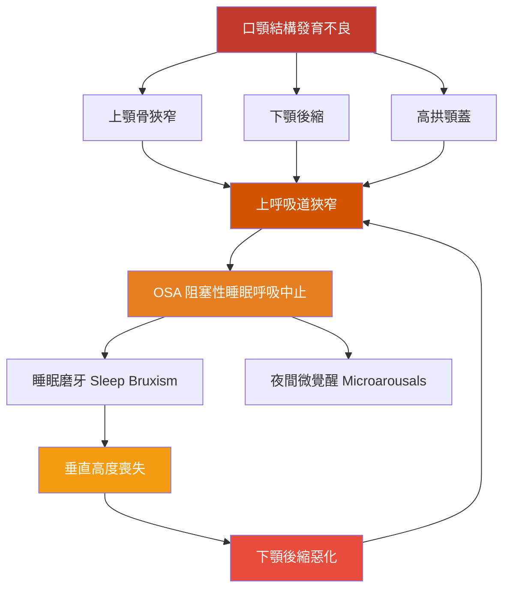

# 早期矯正與上呼吸道狹窄：OSA、磨牙、舌繫帶共病的學術共識與整合治療路徑

<!-- 註記-META-001：整理早期口顎結構發育不良與 OSA、睡眠磨牙、舌繫帶沾黏、垂直高度喪失的共病關係，及分齡多學科整合治療方向（2025–2026 文獻最新趨勢） -->

> **文件版本**：v1.0
> **建立日期**：2026-04-14
> **參考規格**：[[SPEC-01_知識管理系統總覽與架構規格]]
> **目標讀者**：牙醫師、矯正醫師、睡眠醫學相關臨床人員
> **狀態**：draft

---

## 大綱與摘要

<!-- 註記-SEC-001 -->

### 文件大綱

| 章節 | 主題 | 學習目標 |
|:----:|------|---------|
| 一 | 口顎結構發育不良 → OSA 因果鏈 | 理解結構性危險因子，掌握學術共識現況 |
| 二 | 睡眠磨牙與 OSA 的共病關係 | 了解磨牙與微覺醒的連結，掌握早期介入成效數據 |
| 三 | 舌繫帶沾黏與 OSA 的關聯 | 理解舌繫帶對上顎發育與氣道的影響機制 |
| 四 | 垂直高度喪失的惡性循環 | 認識咬合耗損如何累積加重 OSA |
| 五 | 整合治療路徑與分層介入策略 | 建立分齡、多學科治療行動框架 |

<!-- 註記-TBL-001：文件大綱對照表 -->

### 摘要

<!-- 註記-SUM-001 -->
口顎結構發育不良（上顎狹窄、下顎後縮）→ 上呼吸道狹窄 → OSA → 磨牙 → 垂直高度喪失的惡性循環已有學術共識，舌繫帶沾黏更是 OSA 風險的 3.05 倍。治療方向為早期結構性矯正＋OMT＋適時舌繫帶處理的多學科整合模式。

---

## 一、口顎結構發育不良 → 上呼吸道狹窄 → OSA：因果鏈共識

<!-- 註記-SEC-002 -->

口顎結構發育不良與阻塞性睡眠呼吸中止（Obstructive Sleep Apnea, **OSA**）之間的因果關係，已由多篇系統性回顧確認。矯正醫師最容易辨識的三大結構性危險因子如下：

| 危險因子 | 英文術語 | 對氣道的影響 |
|---------|---------|------------|
| **上顎骨狹窄** | Maxillary Constriction | 鼻腔底部狹窄，降低鼻腔氣流量，迫使口呼吸 |
| **下顎後縮** | Mandibular Retrognathia | 舌根位置後移，咽喉腔體積縮小 |
| **高拱顎蓋** | High Arched Palate | 鼻腔容積縮小，常伴隨舌位低下 |

<!-- 註記-TBL-002：OSA 三大結構性危險因子比較表 -->

2026 年 4 月 **AAO（美國矯正學會）更新白皮書**，再次強調矯正醫師在**牙科睡眠醫學（Dental Sleep Medicine）**中的核心角色，顯示此議題已成學術主流，矯正科不再只是「排列牙齒」的專科。

> [!important] 矯正醫師是 OSA 第一線篩查者
> AAO 2026 白皮書明確定位：矯正醫師應是 OSA 共病的第一線辨識者與多學科治療協調者，而非單純技術執行者。

<!-- 註記-FLW-001：口顎發育不良到 OSA 惡性循環路徑圖 -->

---

## 二、睡眠磨牙（Sleep Bruxism）與 OSA 的共病關係

<!-- 註記-SEC-003 -->

睡眠磨牙（Sleep Bruxism, **SB**）與 OSA 的共病有大量文獻佐證。針對正接受矯正治療的 **7–16 歲孩童**的跨截面研究顯示：

| 研究指標 | 發現 |
|---------|------|
| 磨牙與睡眠**微覺醒**（Microarousals）相關性 | 顯著正相關 |
| 磨牙與**上顎第一大臼齒間距**相關性 | 顯著相關 |
| 矯正族群磨牙發生率 | 極高 |

<!-- 註記-TBL-003：矯正族群睡眠磨牙與 OSA 相關指標表 -->

### 早期功能性矯正對磨牙的成效

研究顯示，**早期功能性矯正（Interceptive Orthodontics）**對磨牙的改善遠優於傳統固定式矯正：

| 矯正方式 | 磨牙改善率 | 說明 |
|---------|-----------|------|
| **早期功能性矯正** | **77% 孩童磨牙停止** | 同時解決結構根因 |
| 傳統固定式矯正 | 效果遠不如前者 | 僅排列齒列，不處理氣道 |
| 快速上顎擴張（RME）對磨牙改善 | p = 0.006（顯著） | 同步改善氣道 |

<!-- 註記-TBL-004：早期功能性矯正 vs 傳統矯正對磨牙改善效果比較表 -->

> [!important] 功能性矯正勝過固定矯正
> 早期功能性矯正讓 77% 的孩童磨牙在治療中停止，效果遠優於傳統固定矯正——因為前者直接處理了 OSA 的結構根因。

---

## 三、舌繫帶沾黏（Ankyloglossia）與 OSA 的關聯

<!-- 註記-SEC-004 -->

近年 **meta 分析**已確認舌繫帶沾黏（Ankyloglossia）與 OSA 的顯著關聯：

| 指標 | 數據 |
|------|------|
| OSA 患者中舌繫帶沾黏發生率 vs 非 OSA 者 | **3.05 倍** |
| 研究設計類型 | Meta 分析 |

<!-- 註記-TBL-005：舌繫帶沾黏與 OSA 關聯數據表 -->

### 力學機制

舌繫帶沾黏影響氣道的病理路徑如下：

舌繫帶限制舌頭上抬 → 舌頭無法正常靠壓上顎 → **干擾上顎骨橫向發育** → 上顎骨狹窄 → 上呼吸道狹窄 → OSA 風險上升

然而，學術界對此因果關係在**兒童族群的研究品質**仍有差異，部分研究呼籲更嚴謹的臨床分類。目前尚需更多高品質 RCT 建立明確因果鏈。

[補-1] 舌繫帶沾黏的分級評估工具目前缺乏國際統一標準（Kotlow、Coryllos、Hazelbaker 各有不同分級系統），建議診所採用一套固定分級工具並記錄追蹤，有助於未來參與多中心研究。

> [!important] 舌繫帶沾黏 = OSA 風險 3.05 倍
> Meta 分析確認：OSA 患者中舌繫帶沾黏的發生率是非 OSA 者的 3.05 倍，舌繫帶評估應納入 OSA 初診常規篩查。

---

## 四、咬合垂直高度喪失的惡性循環

<!-- 註記-SEC-005 -->

咬合垂直高度喪失（Loss of Vertical Dimension, **LVD**）目前在直接因果研究上數量較少，但臨床累積機制清楚：

<!-- 註記-FLW-002：垂直高度喪失惡性循環圖 -->

| 循環環節 | 說明 |
|---------|------|
| OSA → 磨牙 | 夜間微覺醒觸發保護性磨牙反射 |
| 磨牙 → 齒面耗損 | 持續性咬合力造成牙齒磨平 |
| 齒面耗損 → LVD | 垂直距離縮短，咬合塌陷 |
| LVD → 下顎後縮 | 面型塌陷，氣道體積縮小 |
| 下顎後縮 → OSA 加重 | 形成惡性循環 |

<!-- 註記-TBL-006：垂直高度喪失惡性循環各環節說明表 -->

> [!important] 垂直高度喪失是累積性陷阱
> OSA → 磨牙 → 垂直高度喪失 → OSA 加重，是一個自我強化的惡性循環，越晚介入越難逆轉。

---

## 五、整合治療路徑與分層介入策略

<!-- 註記-SEC-006 -->

學術界一致推向**分齡、分層、多學科整合**的介入策略，矯正醫師是整條路徑的第一線篩查者與協調者。

### 結構性干預（生長調控期優先）

| 介入方式 | 適應症 | 療效數據 | 注意事項 |
|---------|-------|---------|---------|
| **快速上顎擴張（RME/RPE）** | 確認有上顎狹窄者 | 磨牙改善 p=0.006 | 不能單以 OSA 診斷作為 RME 適應症（AADSM 共識） |
| **上顎前牽（Maxillary Protraction）** | 伴有中面部發育不足的 OSA 兒童 | AHI 下降 45% | 生長調控期介入效果最佳 |
| **下顎前導裝置** | 青春期後、生長板尚活躍時 | 改善氣道體積 | 需評估生長潛力 |

<!-- 註記-TBL-007：結構性干預方式比較表 -->

### 口腔肌功能訓練（OMT / FuCT）

OMT 是目前最具成長空間的**非侵入性治療選項**，多項 meta 分析顯示能有效：
降低 AHI（呼吸中止低通氣指數）、改善血氧飽和度、增強舌肌與咽喉肌張力。

2025–2026 年多個 RCT 臨床試驗正在執行，其中針對**腺樣體扁桃腺切除術後仍有殘餘 OSA 的兒童族群**，OMT 被定位為術後輔助治療的標準流程之一。

### 舌繫帶處理順序

目前新興共識趨向「**切開前後均需 OMT**」：

| 處理階段 | 內容 | 說明 |
|---------|------|------|
| **術前 OMT** | 建立舌頭功能性動作模式 | 避免切開後仍維持代償習慣 |
| **舌繫帶切開術（Frenotomy）** | 解除物理限制 | 單純切開若無 OMT，習慣性代償難以改變 |
| **術後 OMT** | 訓練新的吞嚥/舌位模式 | 最大化功能改善，防止沾黏復發 |
| **頑固性 OSA 成人** | DISE（藥物誘導睡眠內視鏡）確認舌根塌陷後 Frenotomy | 可改善氣道塌陷型態 |

<!-- 註記-TBL-008：舌繫帶處理順序與 OMT 整合表 -->

### 咬合重建與垂直高度回復

| 情境 | 建議介入 | 優先順序 |
|------|---------|---------|
| 磨牙兒童牙齒保護 | **功能性矯正裝置** 優先於單純咬合板 | 功能性裝置同時處理結構根因 |
| 嚴重 LVD 時 | 先恢復咬合穩定 → 再處理睡眠問題 | 順序不可顛倒 |
| 生長期齒槽骨保護 | 注意咬合板對生長期齒槽骨的潛在影響 | 需定期追蹤 |

<!-- 註記-TBL-009：咬合重建策略比較表 -->

### 整合治療路徑總覽

| 問題層次 | 核心問題 | 主要介入 |
|---------|---------|---------|
| **結構根源** | 上顎狹窄、下顎後縮 | RME、功能性矯正裝置、前牽 |
| **氣道功能** | 肌張力不足、口呼吸 | OMT / FuCT（咽喉、舌、唇） |
| **舌繫帶** | 限制舌位，干擾上顎發育 | Frenotomy + 術前術後 OMT |
| **磨牙保護** | 牙齒耗損、垂直高度喪失 | 功能性裝置 > 咬合板 |
| **睡眠監測** | OSA 確診與追蹤 | PSG + CBCT 氣道評估 |

<!-- 註記-TBL-010：整合治療路徑總覽表 -->

[補-2] 台灣矯正學期刊已有垂直距離與口腔矯治器療效的文獻，建議進一步查找並引用，補強本地臨床依據。

[補-3] OMT 對 OSA 兒童的療效 RCT（2025–2026 進行中），建議設定追蹤提醒，待研究結果發表後更新本文件。

---

## 重要提示字句

<!-- 註記-SEC-TIPS -->

> [!important] 矯正醫師是 OSA 第一線篩查者
> AAO 2026 白皮書：矯正醫師應是 OSA 共病的辨識者與多學科治療協調者，而非單純排列牙齒。

> [!important] 功能性矯正勝過固定矯正
> 早期功能性矯正讓 77% 孩童磨牙停止；效果遠優於傳統固定矯正，因為直接解決 OSA 結構根因。

> [!important] 舌繫帶沾黏 = OSA 風險 3.05 倍
> Meta 分析確認：OSA 患者中舌繫帶沾黏發生率是非 OSA 者的 3.05 倍。

> [!important] 垂直高度喪失是累積性陷阱
> OSA → 磨牙 → LVD → OSA 加重，越晚介入惡性循環越難逆轉，早期功能性介入是關鍵時機窗口。

> [!important] 切開前後都需要 OMT
> 單純 Frenotomy 若無配合 OMT，舌頭的代償動作習慣難以改變，療效大打折扣。

---

## 建議補充註記

[補-1] 舌繫帶分級系統目前缺乏國際統一標準（Kotlow、Coryllos、Hazelbaker 各有不同），建議診所採用固定分級工具，有助於未來多中心研究。

[補-2] 台灣矯正學期刊已有垂直距離與口腔矯治器療效的相關文獻，建議進一步查找引用，補強本地臨床依據。

[補-3] OMT 對 OSA 兒童療效的 RCT（2025–2026 進行中），建議設定文獻追蹤提醒，待結果發表後更新本文件。

---

#AI圖片提示詞開始#
主題：早期矯正與 OSA 共病惡性循環
風格：專業醫學圖解風
描述：A circular infographic showing the vicious cycle of pediatric OSA. Starting from the top: "Oral-maxillofacial structural underdevelopment" (maxillary constriction, mandibular retrognathia) → "Upper airway narrowing" → "OSA (Obstructive Sleep Apnea)" → "Sleep bruxism & microarousals" → "Tooth wear & vertical dimension loss" → "Worsened mandibular retrognathia" → back to upper airway narrowing. Each node connected by curved arrows in a clockwise cycle. On the left side, show intervention arrows breaking the cycle: RME/protraction at structural node, OMT at airway function node, Frenotomy+OMT at tongue node. Clean medical illustration style, navy blue and orange color scheme, anatomical cross-section insets for airway narrowing visualization.
尺寸建議：1:1 正方形
#AI圖片提示詞結束#

<!-- 註記-IMG-001：OSA 共病惡性循環與介入點示意圖 -->

#AI圖片提示詞開始#
主題：舌繫帶沾黏影響上顎發育與氣道的機制
風格：專業醫學教科書插圖風
描述：A split sagittal cross-section illustration of the oral cavity. Left panel shows normal tongue function: tongue tip elevated to palate during swallowing, normal palatal arch width, adequate nasopharyngeal airway space. Right panel shows ankyloglossia (tongue tie): tongue restricted from elevating, low tongue posture, narrowed palatal arch, reduced nasopharyngeal airway. Include arrows showing the force direction differences. Label key anatomical structures: tongue (舌), hard palate (硬顎), soft palate (軟顎), nasopharynx (鼻咽腔), hyoid bone (舌骨). Medical textbook quality, clean white background.
尺寸建議：16:9 橫向
#AI圖片提示詞結束#

<!-- 註記-IMG-002：舌繫帶沾黏對上顎發育影響對比圖 -->

---

> **參考文件**：[[RPT-01_齒頸部磨耗與逆吞嚥肌力研究整理]] | [[OMT口腔肌功能治療總覽]] | [[快速上顎擴張RME臨床指引]] | [[牙科睡眠醫學OSA矯正治療]] | [[舌繫帶評估與Frenotomy適應症]]
>
> **引用文獻**：
> - AAO 白皮書 2026 年更新版（矯正醫師在牙科睡眠醫學的角色）
> - 跨截面研究（7–16 歲矯正族群磨牙與微覺醒相關性）
> - RME 對磨牙改善研究（p = 0.006）
> - 早期功能性矯正磨牙改善率研究（77%）
> - 舌繫帶沾黏與 OSA Meta 分析（OR = 3.05）
> - 上顎前牽 OSA 研究（AHI 下降 45%）
