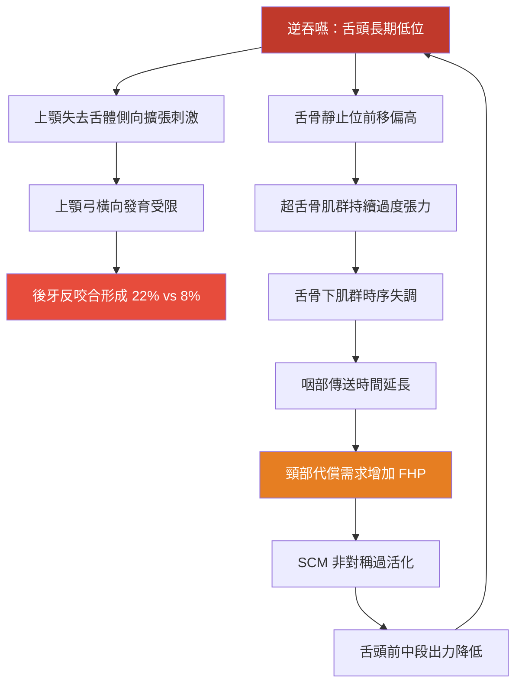
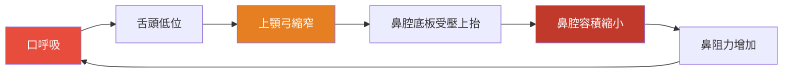

# 逆吞嚥代償機制完整解析、病因學架構與臨床介入

<!-- 註記-META-001：整理逆吞嚥（tongue thrust/atypical swallowing）的完整代償機制（含舌骨、顳肌、SCM、後牙反咬合等），及後牙反咬合矯正策略與口呼吸對顎骨發育影響的完整學術依據 -->

> **文件版本**：v1.0
> **建立日期**：2026-04-14
> **參考規格**：[[SPEC-01_知識管理系統總覽與架構規格]]
> **目標讀者**：牙醫師、矯正醫師、口腔肌功能治療師
> **狀態**：draft

---

## 大綱與摘要

<!-- 註記-SEC-001 -->

### 文件大綱

| 章節 | 主題 | 學習目標 |
|:----:|------|---------|
| 一 | 已知代償機制回顧 | 確認臨床觀察的學術依據（唇肌、緊咬、頸部、下巴） |
| 二 | 文獻補充的代償機制 | 掌握舌骨位移、顳肌過活化、SCM、後牙反咬合等新增証據 |
| 三 | 逆吞嚥的病因學架構 | 建立從嬰兒吸吮轉換到成人進食模式失敗的完整病因分類 |
| 四 | 後牙反咬合矯正策略 | 掌握 Cochrane 證據等級裝置比較與復發預防 |
| 五 | 口呼吸對顎骨發育的影響與介入 | 理解鼻氣道阻塞 → 舌低位 → 顎骨發育不良的惡性循環 |

<!-- 註記-TBL-001：文件大綱對照表 -->

### 摘要

<!-- 註記-SUM-001 -->
逆吞嚥的代償機制遠超臨床常見四項，還包括舌骨複合體前移異常、顳肌過活化、SCM 非對稱代償、舌骨下肌群時序失調及後牙反咬合。病因根源多來自嬰兒吸吮模式轉換失敗，後牙反咬合矯正需搭配 OMT 方能防止復發。

---

## 一、已知四大代償機制的學術確認

<!-- 註記-SEC-002 -->

臨床觀察的四大代償機制均有文獻支持，以下補充學術依據：

| 代償動作 | 學術確認依據 | 量化數據 |
|---------|------------|---------|
| **唇周肌張力異常** | FEA 研究（2023 PMC） | mentalis 應力 18.39 MPa（正常 2.469 MPa）= **7.4 倍** |
| **牙齒過度緊咬** | sEMG 研究：咬肌（masseter）過度活化 | 4 通道 sEMG 確認休息/咬緊/吞嚥均顯著過活化 |
| **頸部肌肉出力 + 頭部前傾後仰** | FHP（Forward Head Posture）與吞嚥代償研究 | SCM 非對稱性過度活化 |
| **下巴後縮 → TMJ 受力增加** | TMD 合併逆吞嚥的 sEMG 研究 | 顳肌、咬肌、二腹肌、SCM 全面過活化 |

<!-- 註記-TBL-002：已知代償機制學術確認表 -->

---

## 二、文獻補充的代償機制（超越臨床常見觀察）

<!-- 註記-SEC-003 -->

### 2.1 舌骨複合體異常位移（Hyoid Complex Malpositioning）

生理吞嚥時，舌骨應在啟動時**垂直向上並略向前移動**。逆吞嚥患者的舌骨長期處於**過高且前移的異常靜止位置**，反映超舌骨肌群（suprahyoid muscles）持續過度張力。

關鍵影響：
- 吞嚥時的喉部關閉時序（laryngeal closure timing）受破壞
- 靜止位置異常 → 吞嚥時有效位移量縮短 → 誤吸風險上升

[補-1] 舌骨靜止位異常在臨床上難以肉眼辨識，建議以超音波 B-mode 量測靜止舌骨位置，建立院內基準值作為逆吞嚥嚴重程度的客觀指標。

### 2.2 顳肌（Temporalis）過度活化

4 通道表面肌電圖（sEMG）研究發現，逆吞嚥合併 TMD 患者中，在**休息、咬緊及吞嚥三種狀態**下，下列肌肉均呈顯著過度活化：

| 肌肉 | 位置 | 代償角色 |
|------|------|---------|
| **顳肌（Temporalis）** | 顳骨側面 | 維持下顎穩定，補償不穩定吞嚥基礎 |
| **咬肌（Masseter）** | 下顎角外側 | 過度緊咬代償 |
| **二腹肌（Digastric）** | 下顎底部 | 舌骨固定異常 |
| **胸鎖乳突肌（SCM）** | 頸側 | 頭部姿勢代償 |

<!-- 註記-TBL-003：逆吞嚥合併 TMD 患者肌肉過活化清單 -->

> [!important] 顳肌是被低估的代償部位
> 顳肌的過度活化常被歸因於夜磨牙或 TMD，但逆吞嚥才可能是源頭——治療應先確認吞嚥模式。

### 2.3 胸鎖乳突肌（SCM）非對稱代償

文獻更精確指出：在逆吞嚥合併**前傾頭姿勢（Forward Head Posture, FHP）**的患者中，SCM 呈現**非對稱性**過度活化（而非雙側對稱增加）。此機制進一步降低舌頭前中段的出力強度，形成代償惡性循環。

### 2.4 舌骨下肌群時序失協調（Infrahyoid Dyscoordination）

正常吞嚥的肌肉啟動時序如下：
前二腹肌（anterior digastric）→ 咬肌 → 舌骨下肌群

逆吞嚥患者中，此時序失調，造成：
- 咽部傳送時間延長
- 頸部姿勢代償需求增加

### 2.5 後牙反咬合（Posterior Crossbite）

2023 年系統性回顧研究指出，逆吞嚥兒童中後牙反咬合盛行率：

| 族群 | 後牙反咬合盛行率 |
|------|--------------|
| **逆吞嚥組** | **22%** |
| 正常吞嚥組 | 8% |

<!-- 註記-TBL-004：逆吞嚥 vs 正常吞嚥後牙反咬合盛行率 -->

機制：逆吞嚥時舌頭長期低位，無法對上顎提供正常側向擴張力 → 上顎弓橫向發育受限 → 下顎牙弓相對寬於上顎 → 後牙反咬合。

<!-- 註記-FLW-001：逆吞嚥完整代償機制連鎖圖 -->

---

## 三、逆吞嚥的病因學架構：嬰兒→成人吸吮轉換失敗

<!-- 註記-SEC-004 -->

逆吞嚥的核心病因是**嬰兒型吸吮模式（infantile swallowing pattern）無法順利轉換為成人型吞嚥模式**，以下依病因類別整理完整學術架構：

| 病因類別 | 具體因素 | 學術依據 |
|---------|---------|---------|
| **飲食轉換障礙** | 精緻/軟質食物過多 | 咀嚼不足 → 口腔運動學習機會減少 |
| **飲食轉換障礙** | 奶嘴或奶瓶使用超過 3 歲 | 強化嬰兒型嘴唇前推吸吮模式 |
| **飲食轉換障礙** | 學習杯（sippy cup）過度使用 | 同上，延緩杯飲學習 |
| **解剖結構限制** | **舌繫帶沾黏（Ankyloglossia）** | 限制舌尖上抬與蠕動波形成 → 轉換障礙 |
| **呼吸功能影響** | 口呼吸（腺樣體/扁桃腺肥大、過敏性鼻炎） | 舌頭低位代償 → 無法形成正確成人吞嚥舌位 |
| **神經感覺發展** | 口腔運動發展遲緩 | 吞嚥運動程式（motor program）成熟延遲 |
| **神經感覺發展** | 感覺統合障礙（Sensory Processing Disorder） | 口腔觸覺過敏 → 迴避舌根上抬 |
| **非營養性吸吮** | 拇指吸吮習慣 | 強化嬰兒型舌推力，與逆吞嚥高度共病 |
| **結構性因素** | 巨舌症（Macroglossia） | 舌體過大，物理上妨礙成熟吞嚥模式建立 |

<!-- 註記-TBL-005：逆吞嚥病因學完整分類表 -->

> [!important] 口呼吸是可逆的病因
> 口呼吸（口水倒流 → 舌低位）是逆吞嚥的重要前置條件；**優先處理鼻氣道阻塞，是逆吞嚥根本性介入的前提步驟**。

---

## 四、後牙反咬合的矯正策略（Cochrane 證據等級）

<!-- 註記-SEC-005 -->

### 裝置效果比較（系統性回顧 GRADE 證據）

| 裝置 | 矯正成功率 | 證據等級 | 適用時機 |
|------|-----------|---------|---------|
| **活動式擴張板（Expansion plate）** | 260/1000（vs 觀察組 14/1000），OR 25.26 | ⊕⊕⊕⊕ 高 | 早期混合齒列 |
| **Quad-helix（固定四螺旋）** | 413/1000，OR 50.59 | ⊕⊕⊕⊕ 高 | 早期混合齒列，**優於活動式** |
| **Hyrax（固定 RME）** | 511/1000，OR 48.02 | ⊕⊕⊕⊝ 中 | 青少年（12–16 歲） |
| **MARPE（骨釘輔助 RME）** | 與 Hyrax 差異無統計意義 | ⊕⊝⊝⊝ 低 | 成人/縫間骨化後 |

<!-- 註記-TBL-006：後牙反咬合矯正裝置效果比較表（Cochrane GRADE） -->

### 早期介入的重要性

乳牙列末期至早期混合齒列（**6–10 歲**）進行矯正，搭配 U-bow activator 後，可在三維方向誘導上顎骨再生長，且預後顯著優於觀察等待組。

### 復發預防：核心挑戰

復發是逆吞嚥後牙反咬合矯正最大挑戰。若未同步處理逆吞嚥本身，擴張後的上顎弓會因持續異常舌壓而再度縮窄。

| 防復發策略 | 效果數據 | 說明 |
|-----------|---------|------|
| **OMT 先於固定矯正** | 開咬矯正效果多 0.6 mm，穩定性更佳 | OMT 應在矯正前先建立正確吞嚥模式 |
| **腭刺（Palatal Crib）搭配擴張** | 6 週內阻斷逆吞嚥舌推力 | 同步減少前牙開咬 |
| **矯正後 OMT 強制追蹤** | 2 年追蹤咬合穩定（2010 年案例研究） | 後牙反咬合合併側方開咬矯正後必需 |

<!-- 註記-TBL-007：後牙反咬合復發預防策略表 -->

> [!important] 矯正前先 OMT
> 研究顯示，OMT 先於固定矯正器者，開咬矯正效果多 0.6 mm 且穩定性更佳——先建立正確吞嚥模式，再矯正骨骼。

---

## 五、口呼吸對舌頭低位與顎骨發育的影響

<!-- 註記-SEC-006 -->

### 舌頭低位的形成機制

口呼吸時，下顎必須下降以維持氣道通暢 → 舌體落至口底，無法維持正確舌位（舌尖抵上顎切牙乳突後方）。

**關鍵研究發現**：即使接受 RME 治療後，若鼻腔通氣尚未改善，舌頭低位也**無法自動恢復**。這說明舌頭低位是鼻氣道阻塞的**功能性代償**，而非獨立問題。

### 上顎骨發育影響（量化數據）

Moss 的「功能基質理論（Functional Matrix Concept）」指出：持續鼻氣流是刺激上顎橫向擴張與顎頂下降的恆常力量。口呼吸時此刺激消失，造成：

| 影響 | 量化研究（ScienceDirect 2014） | 機制 |
|------|------------------------------|------|
| **上顎橫徑縮窄** | 口呼吸組在第二乳臼齒及第一大臼齒位置顎寬顯著小於鼻呼吸組 | 舌體低位 → 喪失側向擴張刺激 |
| **顎頂高拱（High Palatal Vault）** | 顎頂高度顯著增加 | 同上 |
| **上顎長度縮短 + 前牙唇傾** | 系統性回顧確認上顎矢狀向發育不足 | 唇頰肌力失衡 |
| **下顎順時針旋轉** | 下顎後縮、下前臉高增加 | 形成「腺樣體臉（Adenoid Face）」 |

<!-- 註記-TBL-008：口呼吸對顎骨發育影響量化數據表 -->

### 鼻氣道 → 顎骨的惡性循環

<!-- 註記-FLW-002：口呼吸-顎骨發育惡性循環圖 -->

**RME 的雙重效果**：上顎擴張直接擴大鼻腔底板 → 鼻腔容積增加 → 鼻氣道阻力顯著下降（計算流體動力學 CFD 研究確認）。

### 介入策略

| 介入層次 | 具體措施 | 說明 |
|---------|---------|------|
| **根本治因** | 優先處理鼻氣道阻塞（過敏性鼻炎藥物、腺樣體評估手術） | 恢復鼻呼吸是 OMT 有效的前提 |
| **結構矯正** | RME 擴張顎骨 | 同時改善鼻腔容積與舌位 |
| **功能訓練** | OMT 強化舌位訓練 | 鼻呼吸恢復後 OMT 效果更佳（2025 系統性回顧確認） |

<!-- 註記-TBL-009：口呼吸介入策略表 -->

[補-2] 建議同時評估患者的過敏性鼻炎控制狀態（可使用 TNSS 總鼻症狀評分），在鼻炎未控制的情況下進行 OMT 效益有限，此流程應納入逆吞嚥評估的標準化表單。

---

## 重要提示字句

<!-- 註記-SEC-TIPS -->

> [!important] 顳肌過活化是被低估的代償部位
> 逆吞嚥患者顳肌在休息/咬緊/吞嚥三種狀態下均過度活化，臨床應將顳肌 sEMG 納入逆吞嚥評估。

> [!important] 矯正前先 OMT，穩定性更佳
> OMT 先於固定矯正器者，開咬矯正效果多 0.6 mm 且穩定性更佳——順序很重要。

> [!important] 口呼吸舌低位是代償，非獨立問題
> RME 後若鼻腔通氣未改善，舌頭低位不會自動恢復。根治口呼吸才能讓 OMT 有效運作。

> [!important] 後牙反咬合盛行率：逆吞嚥組 22% vs 正常組 8%
> 後牙反咬合是逆吞嚥對顎骨橫向發育的直接衝擊，早期（6–10 歲）介入效果最佳。

> [!important] 復發的關鍵是吞嚥模式，不是骨骼
> 後牙反咬合矯正若未搭配 OMT 矯正逆吞嚥，上顎弓擴張後仍會因持續舌推力而再度縮窄。

---

## 建議補充註記

[補-1] 建議以超音波 B-mode 量測靜止舌骨位置，建立逆吞嚥患者的院內基準值，作為嚴重程度客觀指標及治療追蹤工具。

[補-2] 建議將過敏性鼻炎控制狀態（TNSS 評分）納入逆吞嚥評估標準化表單——鼻炎未控制時 OMT 效益有限，需先轉介耳鼻喉科處理。

[補-3] 逆吞嚥的病因學架構（尤其感覺統合障礙與口腔運動發展遲緩）與職能治療師的評估範疇重疊，建議建立跨科（牙科 + 職能治療 + 耳鼻喉科）轉介流程。

---

#AI圖片提示詞開始#
主題：逆吞嚥完整代償機制連鎖示意圖
風格：專業醫學圖解風
描述：A full-body sagittal schematic focusing on the oral, cervical, and temporomandibular regions. Show the chain reaction of atypical swallowing: starting from low tongue position, show arrows indicating (1) mentalis and orbicularis hyperactivation pushing against anterior teeth, (2) masseter and temporalis overactivation shown with muscle tension lines, (3) SCM asymmetric overactivation shown with highlight on one side, (4) hyoid bone displaced anteriorly and superiorly at rest with a position comparison vs. normal, (5) posterior crossbite shown in dental arch cross-section. Use red/orange for abnormal states and green for normal comparison states. Clean medical textbook illustration style, labeled in both Chinese and English.
尺寸建議：A3 直向
#AI圖片提示詞結束#

<!-- 註記-IMG-001：逆吞嚥代償機制連鎖解剖圖 -->

#AI圖片提示詞開始#
主題：口呼吸對上顎骨發育影響對比圖
風格：專業醫學教科書插圖風
描述：Side-by-side comparison of palatal arch development. Left panel: nasal breathing child — normal tongue position touching palate, normal palatal arch width (shown as cross-section measurement), normal nasal cavity volume, normal facial profile. Right panel: mouth breathing child — low tongue position, narrowed palatal arch (high arched vault), reduced nasal cavity, clockwise mandibular rotation, adenoid face profile. Include measurement arrows for palatal width and vault height. Color code: normal = blue-green, abnormal = orange-red. Educational infographic style.
尺寸建議：16:9 橫向
#AI圖片提示詞結束#

<!-- 註記-IMG-002：口呼吸對上顎骨發育影響對比圖 -->

---

> **參考文件**：[[RPT-01_齒頸部磨耗與逆吞嚥肌力研究整理]] | [[RPT-02_早期矯正與OSA共病整合治療方向]] | [[RPT-04_舌骨位移量化與IOPI-VFSS分析框架]] | [[OMT口腔肌功能治療總覽]] | [[舌繫帶評估與Frenotomy適應症]]
>
> **引用文獻**：
> - 4 通道 sEMG 研究（逆吞嚥合併 TMD 患者肌肉過活化）
> - 2023 年系統性回顧（逆吞嚥與後牙反咬合盛行率 22% vs 8%）
> - Cochrane 系統性回顧（後牙反咬合矯正裝置 GRADE 證據）
> - ScienceDirect 2014（口呼吸對顎寬與顎頂高度的量化研究）
> - AAP 2024 臨床報告（舌繫帶切開術多科整合評估建議）
> - OMT 改善效果研究（OMT 先行組開咬矯正多 0.6 mm）
