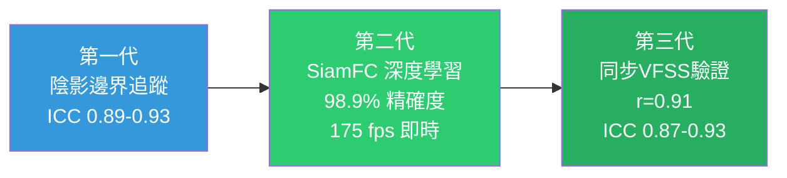

# 舌骨位移量化評估：IOPI-VFSS-超音波三層分析框架

<!-- 註記-META-001：整合舌骨位移與誤吸風險量化、IOPI後置舌壓與VFSS舌骨前移的相關性分析、超音波自動化影像分析技術，建立臨床可執行的三層量化評估框架 -->

> **文件版本**：v1.0
> **建立日期**：2026-04-14
> **參考規格**：[[SPEC-01_知識管理系統總覽與架構規格]]
> **目標讀者**：牙醫師、吞嚥治療師、口腔肌功能研究人員
> **狀態**：draft

---

## 大綱與摘要

<!-- 註記-SEC-001 -->

### 文件大綱

| 章節 | 主題 | 學習目標 |
|:----:|------|---------|
| 一 | 舌骨位移與誤吸風險的量化關聯 | 掌握前移 vs 上移的預測力差異，及臨床閾值 |
| 二 | IOPI 舌壓與 VFSS 舌骨前移的相關性 | 理解兩者測量構念的差異與中介路徑 |
| 三 | 超音波標準化測量協定 | 建立可重複的影像擷取與量測基準 |
| 四 | 超音波自動化追蹤技術演進 | 從人工標記到深度學習即時追蹤 |
| 五 | 整合量化分析框架與臨床落地建議 | 建立三層指標系統，設計乾食訓練研究方案 |

<!-- 註記-TBL-001：文件大綱對照表 -->

### 摘要

<!-- 註記-SUM-001 -->
舌骨**水平前移**（而非垂直上移）是誤吸的唯一統計顯著預測因子，臨床閾值 < 13.5 mm 可預測誤吸陽性（靈敏度 83.9%）。IOPI 後置舌壓透過 FOM-EMG 中介驅動舌骨前移速度，超音波 SiamFC 自動追蹤（精確度 98.9%）已達臨床可行的無輻射替代 VFSS 方案。

---

## 一、舌骨位移與誤吸風險的量化關聯

<!-- 註記-SEC-002 -->

### 1.1 舌骨運動的生理角色

正常吞嚥時，舌骨必須同時向**前（anterior）與上（superior）**移動，此複合運動稱為「**舌喉複合體位移（hyolaryngeal excursion）**」。

| 肌肉 | 功能 | 方向 |
|------|------|------|
| **頦舌骨肌（Geniohyoid）** | 驅動舌骨前移 | 水平向前 |
| **下頜舌骨肌（Mylohyoid）** | 驅動舌骨上移 | 垂直向上 |
| **超舌骨肌群合力** | 確保氣道關閉（LVC）與食物廓清 | 前上合向量 |

<!-- 註記-TBL-002：舌骨運動相關肌肉與功能表 -->

### 1.2 水平前移 vs 垂直上移的預測力差異

**突破性研究發現**（Zhang et al.，分析 1,433 次吞嚥樣本）：

| 位移方向 | 對誤吸（PAS≥2）的預測力 | 臨床意義 |
|---------|----------------------|---------|
| **水平前移（Anterior）↓** | **唯一統計顯著預測因子** | UES 開張不足 → 咽部殘留 → 延遲性誤吸 |
| 垂直上移（Superior）↓ | **未達統計顯著** | 在大樣本中不具獨立預測力 |
| 總位移量（Resultant）↓ | 部分研究顯著，效果被前移稀釋 | 次要指標 |

<!-- 註記-TBL-003：舌骨位移方向對誤吸預測力比較表 -->

> [!important] 前移比上移更重要
> 評估誤吸風險時，舌骨水平前移量是唯一統計顯著預測因子，垂直上移量不具獨立預測力——臨床評估應優先測量前移。

### 1.3 臨床閾值數據

**閾值一：超音波量測（韓國 Yonsei 大學，n=52）**

| 指標 | 閾值 | 靈敏度 | 特異度 | 說明 |
|------|------|--------|--------|------|
| 舌骨最大前移量 | **< 13.5 mm** | 83.9% | 81.0% | 以 PAS ≥ 2 為陽性標準（含穿透與誤吸） |

**閾值二：AI 深度學習模型（腦中風後吞嚥障礙族群，2024）**

| 指標 | 閾值 | AUC | 靈敏度 | 特異度 |
|------|------|-----|--------|--------|
| 最大位移速度（V_max） | **≥ 1.61 cm** | 0.715 | 0.680 | 0.743 |

V_max ≥ 1.61 cm → 出院時成功恢復口腔進食的機率顯著較高。

<!-- 註記-TBL-004：舌骨前移量臨床閾值數據彙整表 -->

### 1.4 LVC 是最強的直接預測因子

重要補充：舌骨位移是**間接**預測因子，真正最強的直接預測因子是：
- **LVC（喉前庭關閉）是否完整**
- **LVC 達成時間（time-to-most-complete LVC）**

機制連鎖：
```
舌骨前移不足
  → 喉部上抬幅度受限（laryngeal elevation ↓）
    → 會厭翻轉角度不完全（epiglottis tilt ↓）
      → 喉前庭關閉延遲或不完整（LVC delayed/incomplete）
        → 食團進入氣道 → 誤吸（aspiration）
```

同時，水平前移不足還導致：
- **梨狀竇殘留（Pyriform Sinus Residue）**：環咽肌無法被充分牽引，UES 開啟面積減少
- **咽部廓清時間延長**（2025 年研究確認：舌骨前移速度與梨狀竇殘留量呈反比）

---

## 二、IOPI 後置舌壓與 VFSS 舌骨前移的相關性

<!-- 註記-SEC-003 -->

### 2.1 時序相關（已高度確認）

2013 年同步記錄研究（舌壓 + 舌骨上肌群 EMG + VF 影像）確認三者時序耦合：

```
舌壓峰值（tongue pressure peak）
  ↓ 約 150–200 ms
舌骨上肌群 EMG 峰值（suprahyoid EMG peak）
  ↓ 約 50–80 ms
舌骨最大前移量（maximum anterior hyoid displacement）
```

| 相關性 | 係數 | p 值 |
|--------|------|------|
| 時序耦合相關係數 | **r = 0.71–0.84** | p < 0.001 |

<!-- 註記-TBL-005：舌壓-EMG-舌骨位移時序耦合相關係數表 -->

機制：舌壓通過 geniohyoid 與 mylohyoid 的解剖連接，以機械力傳遞方式直接驅動舌骨前移。

### 2.2 幅度相關（條件依賴性強）

Steele et al. 2011 年研究確認：
- IOPI 後置舌壓幅度與**舌骨前移速度**（而非位移量）的相關性更強
- 說明：IOPI 測量的最大靜態壓力（peak static pressure）是**舌骨速度**的預測因子，而非**位移距離**

### 2.3 帕金森症族群的重要反例

研究（n=30 名 PD 患者）提出關鍵警示：

| 指標 | 疾病進展前後 | 統計意義 |
|------|------------|---------|
| IOPI 後置舌壓（PTS） | 43.1 → 29.5 kPa | **p = 0.033（顯著下降）** |
| 超音波舌骨位移量 | 無顯著變化 | **p > 0.05（不顯著）** |

**關鍵結論**：
- IOPI 測量的是「**肌肉可產生的最大靜態壓力（muscle capacity）**」
- VFSS 測量的是「**動態任務下的實際運動輸出（motor performance）**」
- 兩者測量的生理構念（construct）**並不完全相同**

> [!important] IOPI ≠ VFSS 的直接替代品
> IOPI 測量肌力容量，VFSS 測量動態運動輸出，兩者構念不同。直接套用 IOPI 數值預測 VFSS 結果存在方法論謬誤。

### 2.4 FOM-EMG 作為中介橋梁指標

2024 年研究確認三層路徑的相關係數：

```
IOPI 後置舌壓（便攜、客觀）
  ↓ r = 0.83–0.91（p < 0.001）
FOM/舌骨上肌群 sEMG 振幅
  ↓ 時序耦合（r = 0.71–0.84）
舌骨前移速度（VFSS/超音波）
```

| 路徑 | 相關係數 | 說明 |
|------|---------|------|
| IOPI → FOM EMG | **r = 0.83–0.91** | 吞嚥任務 > 按壓任務；後置 > 前置 |
| FOM EMG → 舌骨速度 | r = 0.71–0.84 | 時序耦合 |

<!-- 註記-TBL-006：IOPI-FOM-EMG-舌骨速度三層路徑相關係數表 -->

---

## 三、超音波標準化測量協定

<!-- 註記-SEC-004 -->

### 3.1 探頭放置標準

**下頷正中矢狀切面（Submental sagittal view）** 是所有研究共同採用的標準：
- 探頭長軸平行正中矢狀面
- 置於頦部與舌骨之間的軟組織上方
- 輕壓（不壓迫舌骨），標記皮膚接觸點確保可重複

此切面可同時看到：舌骨高回音弧形陰影、下頷骨內面、舌底肌群輪廓。

### 3.2 主要測量參數

| 參數 | 量測方式 | 臨床意義 | 臨床閾值 |
|------|---------|---------|---------|
| **前移幅度（ADA）** | 靜止位 → 最大前移位水平距離 | 最強預後預測因子 | AUC = 0.720，閾值 0.865 cm |
| **上移幅度（SDA）** | 靜止位 → 最大上移位垂直距離 | 反映喉部抬升，次級指標 | — |
| **總移動時間（TMD）** | 吞嚥啟動 → 舌骨回歸靜止（ms） | 吞嚥效率：越短越好 | — |
| **位移速率（ASR）** | ADA / TMD（cm/ms） | 標準化指標，對訓練效果最靈敏 | — |

<!-- 註記-TBL-007：超音波主要測量參數說明表 -->

### 3.3 量測基準點標準化（關鍵步驟）

1. **靜止位**：安靜休息、嘴巴輕閉、不吞嚥，維持 5 秒，取舌骨中心點平均位置
2. **最大前移位**：吞嚥過程中舌骨中心點最前方的 x 座標
3. **計算公式**：ADA（mm）= X_max_anterior − X_resting

[補-1] 跨研究數值差距最高達 2 倍（Logemann 17.3 mm vs Ishida 8.4 mm），主要因量測基準點不統一。必須先建立院內正常值（in-house normative data），不可直接套用文獻數字。

---

## 四、超音波自動化追蹤技術演進

<!-- 註記-SEC-005 -->

### 第一代：陰影邊界自動追蹤（2022）

- 追蹤舌骨後方**聲學陰影（acoustic shadow）**前緣高亮度弧形
- 以樣條插值（spline interpolation）生成連續位移曲線
- **ICC = 0.89–0.93**（與人工標記一致性）
- 限制：最大速度峰值偵測有 ±12 ms 時序誤差

### 第二代：深度學習即時追蹤（PolyU 2021，里程碑研究）

**SiamFC（Fully-Convolutional Siamese Networks）架構**：

| 效能指標 | 數值 |
|---------|------|
| 追蹤精確度（閾值 10 pixels = 3.25 mm） | **98.9%** |
| 追蹤精確度（閾值 5 pixels = 1.63 mm） | 80.5% |
| 平均誤差 | 3.3 pixels（≈ 1.07 mm） |
| 即時運算速度 | **175 fps**（RTX 2060 GPU） |

<!-- 註記-TBL-008：SiamFC 自動追蹤效能指標表 -->

**核心優勢**：只需在第一幀手動框選舌骨陰影區域，網路即可在後續所有幀自動追蹤，不需重新訓練或標記——**適合臨床即時應用**。

### 第三代：同步 VFSS + 超音波驗證（2025 年最新）

n = 23，56 次吞嚥同步記錄，首次直接比對兩者數值：

| 驗證指標 | 數值 |
|---------|------|
| 超音波 vs VFSS 舌骨前移量相關係數 | **r = 0.91（p < 0.0001）** |
| 組內相關係數（ICC） | **0.87–0.93** |

> [!important] 超音波是可靠的無輻射 VFSS 替代工具
> 2025 年研究確認超音波與 VFSS 舌骨前移量相關 r = 0.91，ICC = 0.87–0.93，是目前最強的直接驗證依據。



<!-- 註記-FLW-001：超音波自動化追蹤技術演進時間軸 -->

---

## 五、整合量化分析框架與臨床落地建議

<!-- 註記-SEC-006 -->

### 5.1 三層指標系統

| 層次 | 工具 | 測量構念 | 靈敏度 | 臨床可行性 |
|------|------|---------|--------|-----------|
| **第一層（力量層）** | IOPI 後置舌壓（PTS，kPa） | 肌肉最大靜態輸出 | ⊕⊕⊕⊕ | ⊕⊕⊕⊕（便攜） |
| **第二層（啟動層）** | sEMG FOM 振幅 + 時序 | 動員效率與時序 | ⊕⊕⊕⊕ | ⊕⊕⊕ |
| **第三層（輸出層）** | VFSS 前移速度（mm/s） | 實際功能運動輸出 | ⊕⊕⊕⊕ | ⊕⊕（需輻射） |
| **第三層替代** | 超音波舌骨動態（ADA/ASR） | 同上（無輻射） | ⊕⊕⊕⊕ | ⊕⊕⊕⊕ |

<!-- 註記-TBL-009：三層量化指標系統比較表 -->

驗證因果鏈：「IOPI 提升 → FOM EMG 效率提升 → 舌骨時序改善」

### 5.2 乾食吞嚥訓練超音波監測方案

```
訓練前（基礎測量）
  → 探頭固定於下頷正中
  → 進行 5 次空吞嚥 → 計算平均 ADA（靜止基礎值）

訓練中（即時監測）
  → 給予餅乾，患者自然咀嚼並吞嚥
  → SiamFC 自動追蹤每次吞嚥的舌骨軌跡（即時顯示）
  → 患者視覺回饋（biofeedback）確認舌骨是否前移足夠

訓練後（即時比較）
  → 再次量測 5 次空吞嚥 ADA
  → 訓練前後 ADA 差值 > 2 mm = 即時效應陽性
```

### 5.3 最低配置設備清單

| 設備 | 規格 | 估計費用（NTD） |
|------|------|--------------|
| 攜帶型超音波（如 Clarius L7） | 線型探頭，WiFi 傳輸至 iPad | 120,000–180,000 |
| 探頭固定架 | 3D 列印客製化 | 低成本自製 |
| SiamFC 追蹤軟體 | PolyU 開源代碼（GitHub） | 免費 |
| ImageJ | 備用人工量測工具 | 免費 |

<!-- 註記-TBL-010：最低配置設備清單與費用估計 -->

### 5.4 技術限制與解決方案

| 限制 | 解決方案 |
|------|---------|
| **乾食固態食團干擾影像** | 「水-乾食對比法」：先記錄清水吞嚥為基準，再記錄乾食吞嚥比較 |
| **探頭壓力不一致** | 使用探頭固定架（如 Soma Dynamics 頭頸固定架） |
| **垂直軸校正無統一標準** | 以患者 C4–C6 椎間距（約 8–10 mm/椎間）作為個體化校正基準 |

<!-- 註記-TBL-011：超音波技術限制與解決方案表 -->

[補-2] 建議以 20–30 名無吞嚥障礙成人進行基礎量測，建立院內 ADA、TMD、ASR 正常範圍，再以此為基準評估逆吞嚥患者偏差程度。

[補-3] SiamFC 開源代碼由香港理工大學（PolyU）公開於 GitHub，可直接下載使用。研究設計若能與 PolyU 吞嚥研究團隊合作，有利於跨國多中心研究的發表。

---

## 重要提示字句

<!-- 註記-SEC-TIPS -->

> [!important] 前移比上移更重要
> 舌骨水平前移是誤吸的唯一統計顯著預測因子（Zhang et al., 1,433 次吞嚥），垂直上移量不具獨立預測力。

> [!important] 臨床閾值：< 13.5 mm = 高誤吸風險
> 超音波舌骨最大前移量 < 13.5 mm 預測誤吸陽性，靈敏度 83.9%、特異度 81.0%（Yonsei 大學研究）。

> [!important] IOPI ≠ VFSS 的直接替代
> IOPI 測量靜態肌力容量，VFSS 測量動態運動輸出，構念不同，須以 FOM-EMG 作為中介才能建立路徑因果。

> [!important] 超音波是可靠的無輻射替代 VFSS 工具
> 2025 年同步驗證研究：超音波 vs VFSS 舌骨前移相關 r = 0.91，ICC = 0.87–0.93。

> [!important] 必須先建立院內正常值
> 文獻舌骨前移量跨研究差距高達 2 倍，不可直接套用文獻數字，必須以自己的協定建立院內基準值。

---

## 建議補充註記

[補-1] 必須先建立院內正常值：文獻舌骨前移量跨研究差距高達 2 倍（17.3 mm vs 8.4 mm），主要因量測基準點不統一，不可直接套用文獻閾值。

[補-2] 建議以 20–30 名無吞嚥障礙成人建立院內 ADA、TMD、ASR 正常範圍，作為評估逆吞嚥患者及追蹤治療進展的個體化基準。

[補-3] SiamFC 開源代碼由香港理工大學（PolyU）公開，可直接應用。建議與 PolyU 吞嚥研究團隊建立合作關係，有利於跨國多中心研究。

---

#AI圖片提示詞開始#
主題：IOPI-FOM-EMG-舌骨前移三層量化路徑圖
風格：商務資訊圖表風
描述：A vertical cascade diagram showing three measurement tiers connected by arrows. Top tier: IOPI device measuring posterior tongue pressure (labeled "力量層 / Capacity Layer", kPa values shown). Middle tier: Surface EMG electrode on floor of mouth with signal waveform (labeled "啟動層 / Activation Layer", amplitude and timing shown). Bottom tier: Ultrasound B-mode image with hyoid bone highlighted and displacement measurement arrows (labeled "輸出層 / Output Layer", mm/s values shown). Show correlation coefficients between tiers (r=0.83-0.91 between top-middle, r=0.71-0.84 between middle-bottom). Include small warning icon noting "PD exception — constructs differ". Clean infographic style, navy blue and teal color scheme.
尺寸建議：1:1 正方形
#AI圖片提示詞結束#

<!-- 註記-IMG-001：三層量化路徑示意圖 -->

#AI圖片提示詞開始#
主題：超音波舌骨自動追蹤技術演進時間軸
風格：科技感資訊圖表風
描述：A horizontal timeline showing the evolution of ultrasound hyoid tracking technology. 2022: Generation 1 showing acoustic shadow boundary detection with manual landmark comparison (ICC 0.89-0.93). 2021: Generation 2 showing SiamFC deep learning architecture with real-time tracking box on ultrasound image, performance stats (98.9% accuracy, 175 fps). 2025: Generation 3 showing split screen of VFSS X-ray and ultrasound image side by side with correlation line chart (r=0.91). Each generation has an icon indicating clinical feasibility level. Modern tech illustration style, dark background, blue-green accent colors.
尺寸建議：16:9 橫向
#AI圖片提示詞結束#

<!-- 註記-IMG-002：超音波自動追蹤技術演進圖 -->

---

> **參考文件**：[[RPT-03_逆吞嚥代償機制完整解析與病因學架構]] | [[RPT-05_深頸屈肌訓練與高張力vs肌力不足鑑別診斷]] | [[VFSS吞嚥螢光透視標準化協定]] | [[吞嚥障礙評估工具比較]]
>
> **引用文獻**：
> - Zhang et al.（1,433 次吞嚥，水平前移為唯一統計顯著誤吸預測因子）
> - Yonsei 大學前瞻性研究（n=52，閾值 13.5 mm，靈敏度 83.9%）
> - 2024 年深度學習模型（V_max 閾值 1.61 cm，AUC = 0.715）
> - 2013 年同步舌壓-EMG-VF 研究（時序耦合 r = 0.71–0.84）
> - 2024 年 FOM-EMG 中介研究（r = 0.83–0.91）
> - PolyU SiamFC 研究 2021（98.9% 追蹤精確度，175 fps）
> - 2025 年同步 VFSS + 超音波驗證（r = 0.91，ICC = 0.87–0.93）
