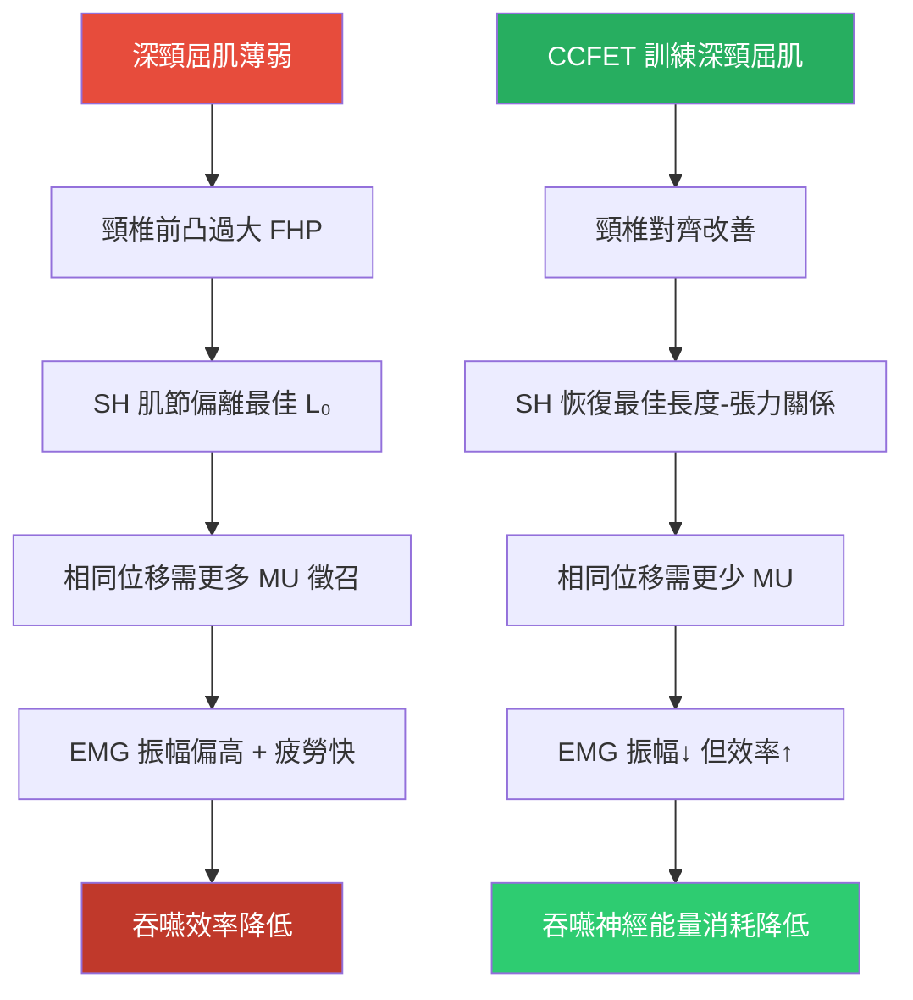
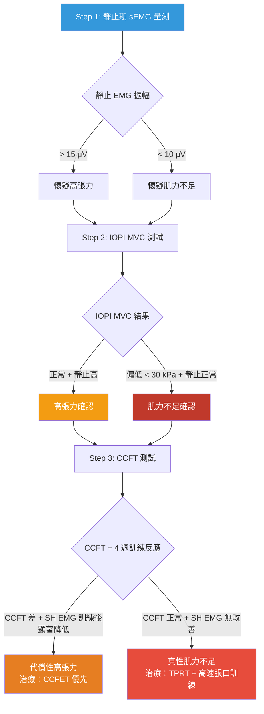

# 深頸屈肌訓練、舌骨位移閾值與高張力 vs 肌力不足鑑別診斷

<!-- 註記-META-001：整理深頸屈肌（DCF）訓練對吞嚥運動單位徵召模式的優化機制、舌骨位移與誤吸機率的量化閾值，以及靜止期高張力 vs 真性肌力不足的系統性鑑別診斷框架 -->

> **文件版本**：v1.0
> **建立日期**：2026-04-14
> **參考規格**：[[SPEC-01_知識管理系統總覽與架構規格]]
> **目標讀者**：牙醫師、吞嚥治療師、口腔肌功能研究人員
> **狀態**：draft

---

## 大綱與摘要

<!-- 註記-SEC-001 -->

### 文件大綱

| 章節 | 主題 | 學習目標 |
|:----:|------|---------|
| 一 | 深頸屈肌訓練優化吞嚥運動單位徵召 | 理解「深層穩定先行，淺層後隨」的神經控制階層機制 |
| 二 | 舌骨位移量化閾值與誤吸機率 | 掌握三組閾值數據及其預測力差異 |
| 三 | 高張力 vs 肌力不足的三層鑑別診斷 | 建立 sEMG + IOPI + CCFT 的系統性鑑別流程 |
| 四 | 三議題整合：評估-治療循環 | 將三個量化工具串接成完整的臨床行動框架 |

<!-- 註記-TBL-001：文件大綱對照表 -->

### 摘要

<!-- 註記-SUM-001 -->
深頸屈肌（DCF）訓練透過恢復 SH 肌群的最佳長度-張力關係，降低吞嚥所需運動單位數目（「越輕鬆越有效」）。靜止期 sEMG 高張力（>15 μV）配合 IOPI 正常代表代償性高張力，應以 CCFET 優先；真性肌力不足（IOPI <30 kPa + 靜止 EMG 正常）則需直接 SH 肌力訓練。

---

## 一、深頸屈肌訓練如何優化吞嚥期運動單位徵召

<!-- 註記-SEC-002 -->

### 1.1 核心機制：「深層穩定先行，淺層後隨」

2012 年基礎性研究（n=45 名健康受試者，*Journal of Oral Rehabilitation*）確立了深頸屈肌（deep cervical flexors, **DCF**）與舌骨上肌群（suprahyoid muscles, **SH**）的**神經控制階層**關係：

> 深頸屈肌的穩定是前提，穩定建立後，淺層肌肉（SH、SCM）才能以**更少的運動單位徵召**完成相同的吞嚥任務

分子機制連鎖如下：

```
深頸屈肌（Longus colli / Longus capitis）活化
  ↓
頸椎前凸角減少（頸椎對齊改善）
  ↓
SH 的靜止長度-張力關係恢復至最佳工作區間
  （肌節恢復到 L₀ 附近，Hill 方程式最大收縮效率點）
  ↓
吞嚥時 SH 可動員的「功能性收縮幅度（functional excursion）」增加
  ↓
完成相同位移量所需的運動單位數目減少
  → EMG 振幅↓ + 吞嚥效率↑（矛盾性的「越輕鬆越有效」現象）
```

### 1.2 HD-sEMG 的運動單位徵召量化（2024 年最新）

2024 年首次以**高密度表面肌電圖（HD-sEMG，64 通道電極陣列）**量化 SH 肌群的運動單位（Motor Unit, **MU**）徵召特性：

| 指標 | 高力量時的變化 | 代表意義 |
|------|-------------|---------|
| **修正熵（Modified Entropy）** | ↓ 下降 | MU 從分散模式轉為同步集中模式 |
| **相關係數** | ↓ 下降 | 同步化程度增加 |
| **變異係數** | ↑ 上升 | 高閾值 MU 大量徵召 |

<!-- 註記-TBL-002：HD-sEMG 運動單位徵召特性量化指標表 -->

**CCFET 訓練後的預期效果**：相同任務下 MU 的修正熵維持低值（不需要額外徵召高閾值 MU），反映**神經控制效率提升**。

### 1.3 明海大學 2025 年直接確認

具備活躍深頸屈肌的受試者，吞嚥時所需的 SH 肌肉活動量**顯著低於**深頸屈肌薄弱者。

**臨床意義**：深頸屈肌訓練本質上是在**降低吞嚥的神經能量消耗（swallowing effort reduction）**——這對需要每天吞嚥 600–2000 次的逆吞嚥患者具有重要的疲勞管理意義。

> [!important] 「越輕鬆越有效」的矛盾現象
> DCF 訓練後 SH 的 EMG 振幅下降，但吞嚥效率反而提升——這不是肌力減弱，而是神經控制效率改善的標誌。



<!-- 註記-FLW-001：深頸屈肌訓練對吞嚥效率的優化機制圖 -->

---

## 二、舌骨位移增量與誤吸機率的量化閾值

<!-- 註記-SEC-003 -->

### 2.1 三組互補的臨床閾值

**閾值一：超音波量測（最廣泛引用）**

| 來源 | 研究對象 | 指標 | 閾值 | 靈敏度 | 特異度 |
|------|---------|------|------|--------|--------|
| 韓國 Yonsei 大學 | n=52 吞嚥障礙患者 | 舌骨最大前移量 | **< 13.5 mm** | **83.9%** | **81.0%** |

以 PAS（Penetration-Aspiration Scale）≥ 2 為陽性標準（含穿透與誤吸）。

<!-- 註記-TBL-003：舌骨前移量臨床閾值一覽表 -->

**閾值二：AI 深度學習模型（腦中風後族群，2024）**

| 指標 | 閾值 | AUC | 靈敏度 | 特異度 | 臨床意義 |
|------|------|-----|--------|--------|---------|
| 最大移動速度（V_max） | **≥ 1.61 cm** | 0.715 | 0.680 | 0.743 | ≥ 1.61 cm → 出院時成功恢復口腔進食機率顯著較高 |

<!-- 註記-TBL-004：AI 模型舌骨速度閾值表 -->

**閾值三：1,433 次吞嚥大型研究（方向性差異）**

| 位移方向 | 預測力 | 說明 |
|---------|--------|------|
| **水平前移（Anterior）↓** | 唯一統計顯著 | UES 開張不足 → 咽部殘留 → 延遲性誤吸 |
| 垂直上移（Superior）↓ | 未達統計顯著 | 不具獨立預測力 |

<!-- 註記-TBL-005：舌骨位移方向預測力差異表 -->

### 2.2 逆吞嚥對舌骨閾值的特殊影響

逆吞嚥患者的舌骨靜止位置**已異常前移偏高**，吞嚥啟動時的「有效位移量」因此縮短：

1. **代償性張力消耗**：SH 長期維持異常靜止張力，吞嚥時無足夠剩餘收縮幅度產生前移
2. **時序失協調**：舌骨靜止位過高，有效加速期縮短，LVC 達成時間延長
3. **FHP 疊加效應**：Forward Head Posture 抑制舌頭向上出力，進一步壓縮前移空間

> [!important] 逆吞嚥患者的「起始位置異常」陷阱
> 逆吞嚥患者舌骨靜止位已偏高偏前，即使絕對前移量看似「正常」，實際有效位移量仍可能不足——評估時需同時記錄靜止位基準。

---

## 三、高張力 vs 肌力不足的三層鑑別診斷

<!-- 註記-SEC-004 -->

這是臨床上最困難、文獻中最少直接討論的鑑別診斷議題，可透過以下**三層系統性方法**區分：

### 第一層：靜止期 sEMG（直接偵測靜止張力）

正常 SH 肌群在「靜止閉口、不吞嚥」狀態下應呈現**電靜默（electrical silence）**，EMG 振幅接近基線雜訊。

| EMG 靜止期表現 | 解讀 | 可能病因 |
|-------------|------|---------|
| 振幅持續升高（**> 基線 15–20 μV**） | **高張力（Hypertonicity）** | FHP、TMD 代償、中樞敏感化 |
| 振幅正常（**< 10 μV**） | 低張力或正常靜止張力 | 問題在動態徵召能力，非靜止狀態 |

<!-- 註記-TBL-006：靜止期 sEMG 判讀標準表 -->

### 第二層：IOPI 最大舌壓（MVC）+ 疲勞指數

| 測試項目 | 高張力患者 | 肌力不足患者 |
|---------|-----------|------------|
| **IOPI MVC 最大舌壓** | 接近正常或輕微下降 | **顯著下降（< 30 kPa，低於正常值 -2 SD）** |
| **60 秒疲勞指數（50% MVC）** | 疲勞**快**（肌肉已被預消耗） | 疲勞速度正常或緩慢（肌力儲備低但效率不差） |
| **EMG 頻率（Mean Power Frequency, MPF）** | MPF 初始值偏低（快縮肌已耗盡，慢縮肌優先徵召） | MPF 正常初始值，但達峰後快速下降（快縮肌少，耐力差） |

<!-- 註記-TBL-007：IOPI MVC 與疲勞指數鑑別高張力 vs 肌力不足比較表 -->

### 第三層：顱頸屈曲測試（CCFT）作為鑑別工具

**顱頸屈曲測試（Craniocervical Flexion Test, CCFT）**是最關鍵的鑑別額外步驟：

| CCFT 結果 + 訓練反應 | 診斷 | 治療優先序 |
|--------------------|----|----------|
| **CCFT 表現差** + 4 週 CCFET 訓練後 **SH 靜止 EMG 顯著降低** | **代償性高張力**（FHP/DCF 薄弱引起） | CCFET 優先 → 再評估是否需 TPRT |
| **CCFT 表現正常** + 訓練後 **SH EMG 無明顯改善** | **真性肌力不足** | 直接 TPRT + 高速張口訓練 |

<!-- 註記-TBL-008：CCFT 鑑別診斷結果解讀表 -->

### 三層鑑別診斷流程圖



<!-- 註記-FLW-002：三層鑑別診斷決策樹流程圖 -->

> [!important] 高張力 ≠ 肌力強
> 靜止期 EMG 高不代表肌力充足，反而代表肌肉被「預消耗」，可動員的剩餘收縮幅度反而減少——兩者的治療方向完全相反。

---

## 四、三議題整合：評估-治療循環

<!-- 註記-SEC-005 -->

三個議題在逆吞嚥患者的臨床處置中形成一個完整的**評估-治療-驗證循環**：

| 步驟 | 工具 | 目的 | 下一步判斷 |
|------|------|------|----------|
| **1. 鑑別診斷** | 靜止 sEMG → IOPI MVC → CCFT | 區分高張力 vs 肌力不足 | 決定治療優先序 |
| **2. 基礎量化** | IOPI + 超音波 ADA | 建立個人基準值，對照 13.5 mm 閾值 | 確認起點偏差程度 |
| **3. 針對性治療** | 高張力 → CCFET；肌力不足 → TPRT + 高速張口訓練 | 根本改善運動單位徵召效率 | 4–8 週後重測 |
| **4. 效果驗證** | 超音波舌骨前移量是否超過 13.5 mm 閾值 | 確認治療達標 | 達標 → 進入維持期；未達標 → 調整方案 |

<!-- 註記-TBL-009：評估-治療-驗證循環四步驟表 -->

### 肌少症代償機制的臨床啟示（逆吞嚥的對比參考）

2020 年研究（Chen et al., n=227 位高齡者）發現：

| 族群 | IOPI 舌壓 | 舌骨位移量 | 吞嚥速度 |
|------|----------|-----------|---------|
| 肌少症老人 | **顯著低於正常** | **代償性增大** | **顯著下降** |
| 正常對照 | 正常 | 正常 | 正常 |

**與逆吞嚥的類比**：「需要等待口水較多才能吞嚥」的逆吞嚥患者，可能不是肌力不夠，而是**啟動效率差、時序延遲**——單純提升 IOPI 舌壓並不能自動改善吞嚥時序，**必須配合動態訓練**。

[補-1] 建議在初次評估時同步記錄「患者主觀吞嚥費力感（Effort Scale, 0–10）」，作為 IOPI 客觀肌力與主觀功能體驗的對比指標。若 IOPI 正常但費力感高，優先懷疑時序失協調而非肌力不足。

[補-2] CCFET（顱頸屈曲耐力訓練）與 Shaker Exercise 的訓練頻率在不同文獻中差異較大（每日 1–3 次），建議制定診所標準化訓練處方，並記錄訓練日誌以便調整強度。

---

## 重要提示字句

<!-- 註記-SEC-TIPS -->

> [!important] 「越輕鬆越有效」的矛盾現象
> DCF 訓練後 SH 的 EMG 振幅下降，吞嚥效率反而提升——這是神經控制效率改善的標誌，不是肌力減弱。

> [!important] 逆吞嚥患者的靜止位陷阱
> 舌骨靜止位已異常前移偏高，評估時必須同時記錄靜止基準，不能只看絕對前移量。

> [!important] 高張力 ≠ 肌力強
> 靜止期 EMG 高代表肌肉被「預消耗」，可動員剩餘收縮幅度反而減少，治療方向與肌力不足完全相反。

> [!important] 達標閾值：前移量 ≥ 13.5 mm
> 超音波舌骨最大前移量 ≥ 13.5 mm 是治療達標的客觀驗證標準（靈敏度 83.9%、特異度 81.0%）。

> [!important] 時序問題比肌力問題更難識別
> IOPI 正常但主觀費力感高 → 優先懷疑時序失協調，而非肌力不足；動態訓練優先於靜態肌力訓練。

---

## 建議補充註記

[補-1] 建議初次評估同步記錄「主觀吞嚥費力感（Effort Scale, 0–10）」，作為 IOPI 客觀肌力與主觀體驗的對比指標。IOPI 正常但費力感高 → 優先懷疑時序失協調。

[補-2] CCFET 與 Shaker Exercise 訓練頻率文獻差異較大（每日 1–3 次），建議制定診所標準化訓練處方並記錄日誌，有助於調整強度與未來研究參照。

[補-3] 本文件的三層鑑別框架（sEMG → IOPI → CCFT）目前尚無單一文獻將三者整合為統一臨床流程，屬於臨床推演整合。建議未來設計前瞻性研究，驗證此三層流程對治療決策的一致性與效度。

---

#AI圖片提示詞開始#
主題：深頸屈肌訓練對吞嚥運動單位徵召優化機制
風格：專業醫學教育圖解風
描述：A two-panel comparison diagram. Left panel "Before CCFET Training": shows exaggerated cervical lordosis (forward head posture), suprahyoid muscle fiber at suboptimal length (depicted as sarcomere diagram with compressed overlap), high motor unit recruitment shown as dense EMG signal waveform, and poor swallowing efficiency indicator. Right panel "After CCFET Training": shows corrected cervical alignment, suprahyoid muscle fiber at optimal L₀ length, fewer motor units recruited shown as clean lower-amplitude EMG waveform, and improved swallowing efficiency indicator. Include Hill equation force-length curve inset showing optimal vs suboptimal operating points. Clean medical education style, blue-green color scheme, labeled in both Chinese and English.
尺寸建議：16:9 橫向
#AI圖片提示詞結束#

<!-- 註記-IMG-001：深頸屈肌訓練前後吞嚥效率對比圖 -->

#AI圖片提示詞開始#
主題：高張力 vs 肌力不足的三層鑑別診斷流程
風格：臨床決策樹資訊圖表風
描述：A clinical decision tree infographic with three vertical assessment layers. Layer 1 (top): shows sEMG electrode on submental region with two readout boxes — left box shows elevated resting baseline (>15 μV, labeled "Hypertonicity suspected", red highlight), right box shows flat baseline (<10 μV, labeled "Weakness suspected", blue highlight). Layer 2 (middle): shows IOPI device with tongue bulb, two result boxes — "MVC normal + resting high = Hypertonicity confirmed" in orange, "MVC low <30 kPa + resting normal = Weakness confirmed" in blue. Layer 3 (bottom): shows CCFT head position test, branching to two treatment paths — left branch "CCFET priority" in warm orange, right branch "TPRT + High-speed jaw training" in cool blue. Clean clinical flowchart style, white background, clear arrows.
尺寸建議：A3 直向
#AI圖片提示詞結束#

<!-- 註記-IMG-002：高張力 vs 肌力不足三層鑑別診斷決策樹 -->

---

> **參考文件**：[[RPT-04_舌骨位移量化評估_IOPI-VFSS-超音波三層分析框架]] | [[RPT-03_逆吞嚥代償機制完整解析與病因學架構]] | [[吞嚥障礙評估工具比較]] | [[CCFET顱頸屈曲耐力訓練臨床指引]]
>
> **引用文獻**：
> - 2012 年 DCF 與 SH 神經控制階層研究（*Journal of Oral Rehabilitation*，n=45）
> - 2024 年 HD-sEMG 64 通道研究（SH 肌群 MU 徵召特性量化）
> - 明海大學 2025 年研究（DCF 活躍者 SH 肌肉活動量顯著較低）
> - 韓國 Yonsei 大學研究（n=52，閾值 13.5 mm，靈敏度 83.9%）
> - 2024 年深度學習模型（V_max 閾值 1.61 cm，AUC = 0.715）
> - Zhang et al. 2019（1,433 次吞嚥，水平前移為唯一顯著預測因子）
> - Chen et al. 2020（n=227，肌少症代償性舌骨位移增大研究）
