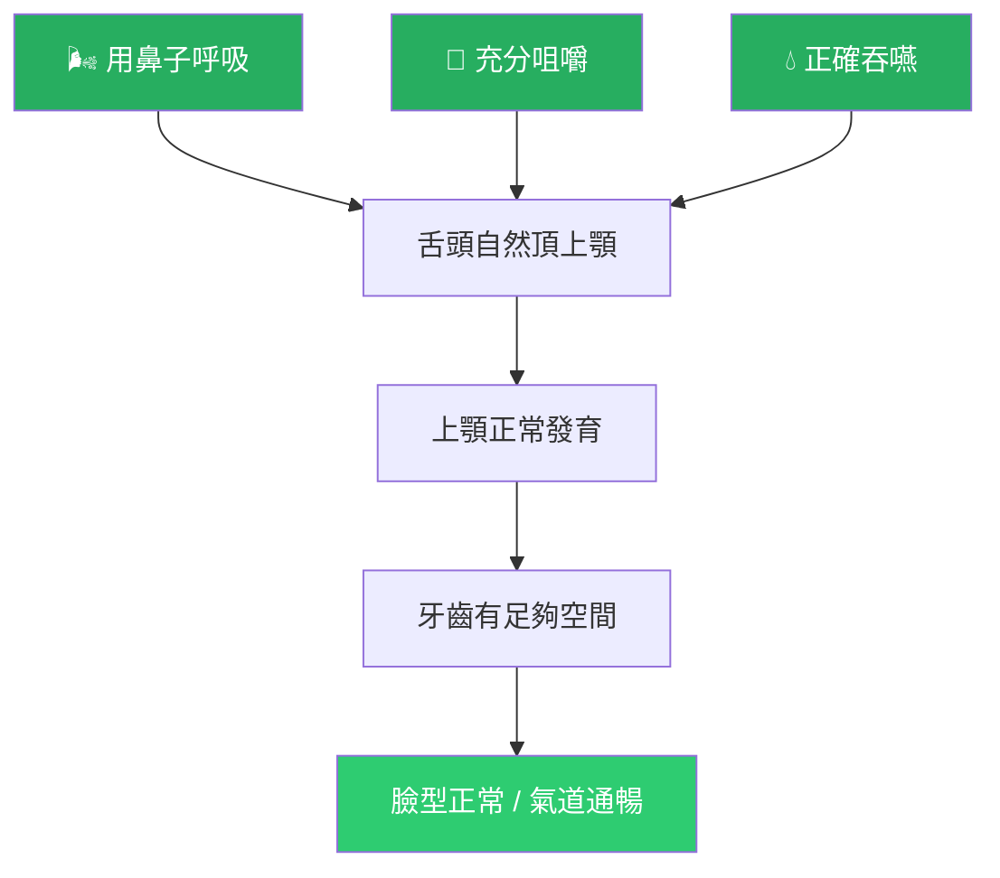

# 孩子的嘴巴怎麼用，決定了臉型和牙齒的未來

<!-- 註記-META-001：一般民眾版教學文件，說明口顎功能異常（口呼吸、逆吞嚥、低舌位）如何影響兒童顎骨發育、齒列與睡眠健康，以及何時需要就醫評估 -->

> **文件版本**：v1.0
> **建立日期**：2026-04-14
> **目標讀者**：家長、一般民眾
> **狀態**：draft

---

## 大綱與摘要

<!-- 註記-SEC-001 -->

### 文件大綱

| 章節 | 主題 | 你會學到什麼 |
|:----:|------|------------|
| 一 | 這個問題在說什麼 | 為什麼嘴巴的使用方式會影響臉型和牙齒 |
| 二 | 三件一定要記住的事 | 鼻呼吸、咀嚼、吞嚥的重要性 |
| 三 | 哪些行為要注意 | 孩子的日常警訊清單 |
| 四 | 什麼時候要看醫生 | 幾歲是最好的介入時機 |
| 五 | 家長可以做的事 | 從飲食與習慣開始的預防 |

<!-- 註記-TBL-001：文件大綱表 -->

### 摘要

<!-- 註記-SUM-001 -->
孩子嘴巴怎麼呼吸、怎麼咀嚼、怎麼吞嚥，會一起影響臉型與牙床發育。口呼吸、吃太軟的食物、吞嚥時舌頭往前推，都是常見但容易被忽略的早期警訊。6–10 歲是最佳介入時機，越早發現越容易改善。

---

## 一、這個問題在說什麼

<!-- 註記-SEC-002 -->

很多父母發現孩子牙齒不整齊，才開始想到矯正。但**牙齒不整齊往往只是結果，不是原因**。

真正的原因，可能是孩子從小嘴巴的使用方式出了問題。

**嘴巴的三件日常工作：呼吸、咀嚼、吞嚥**

| 工作 | 正確方式 | 常見問題 |
|------|---------|---------|
| **呼吸** | 用鼻子呼吸，嘴唇自然閉合 | 張口呼吸，舌頭低垂 |
| **咀嚼** | 兩側交替咬，充分咀嚼再吞 | 吃太軟、常偏一側、含著不嚼 |
| **吞嚥** | 舌頭頂上顎，嘴唇放鬆 | 舌頭往前推，嘴唇用力夾緊 |

<!-- 註記-TBL-002：呼吸/咀嚼/吞嚥正確與問題對照表 -->

這三件事如果長期做錯，就像一個工廠的機器一直轉錯方向——

- 上顎骨因為沒有舌頭頂著，變得太窄、太高
- 下巴因為承受了不對的力量，看起來往後縮
- 牙齒因為被舌頭推著長，變得亂七八糟
- 鼻腔空間因為上顎太窄而縮小，呼吸就更困難

這是一個**惡性循環**，越晚發現，越難改善。

> [!important] 牙齒不整齊是結果，不是原因
> 孩子的嘴巴怎麼呼吸、怎麼吞嚥，決定了顎骨怎麼長。排列牙齒之前，先找出功能問題，才能真正解決問題。

---

## 二、三件一定要記住的事

<!-- 註記-SEC-003 -->

<!-- 註記-FLW-001：正確口腔功能對顎骨發育的影響圖 -->

### 第一件事：鼻呼吸比口呼吸更重要

用鼻子呼吸時，舌頭自然會放在上顎，這個力量是刺激上顎骨橫向發育的關鍵。長期口呼吸的孩子，舌頭低垂、上顎變窄，臉型也容易拉長、下巴後縮——這就是俗稱的「腺樣體臉（Adenoid Face）」。

**如果孩子常常鼻塞，要優先看耳鼻喉科**，排除過敏性鼻炎或腺樣體肥大。鼻子通了，很多口腔問題會跟著改善。

### 第二件事：吃太軟、太精緻的食物會讓牙床發育不足

咀嚼是刺激牙床骨骼生長的運動。現代孩子吃太多軟食（麵包、軟飯、磨泥食物），咀嚼刺激不夠，上下顎骨發育不足，牙齒沒地方長，就會擠在一起。

建議從副食品階段開始，讓孩子接觸不同質地的食物，慢慢訓練咀嚼能力。

### 第三件事：吞嚥時舌頭不應該往前推

正確的吞嚥，舌頭應該頂在上顎，而不是往前推牙齒。如果孩子每次吞嚥都用舌頭往前推——一天吞嚥約 1,000 次——這個持續的推力，比刷牙太大力還要傷牙齒和顎骨。

---

## 三、哪些行為要注意

<!-- 註記-SEC-004 -->

以下清單，如果孩子有三項以上，建議盡早就醫評估：

| 類別 | 警訊行為 | 可能的問題 |
|------|---------|----------|
| **呼吸** | 睡覺張口、打呼、睡不好 | 口呼吸、睡眠呼吸中止 |
| **呼吸** | 白天常常嘴巴開開的 | 長期口呼吸習慣 |
| **進食** | 吃飯很慢、含著食物不吞 | 咀嚼效率差、吞嚥模式異常 |
| **進食** | 只吃軟食、偏食 | 咀嚼肌發育不足 |
| **吞嚥** | 吞嚥時嘴唇很用力夾緊 | 逆吞嚥（舌頭往前推） |
| **吞嚥** | 需要喝水才能吞食物 | 吞嚥功能不佳 |
| **外觀** | 下巴看起來偏小後縮 | 下顎發育不足 |
| **外觀** | 上下牙齒咬不到 | 前牙開咬 |
| **習慣** | 常常咬手指、吸拇指 | 強化錯誤吞嚥模式 |
| **習慣** | 說話發音怪、口齒不清 | 舌位異常 |

<!-- 註記-TBL-003：兒童口腔功能問題警訊清單 -->

> [!important] 睡覺打呼不是「睡得好」的表現
> 兒童打呼可能是睡眠呼吸中止的早期訊號，長期缺氧會影響生長激素分泌、學習專注力與行為發展。建議就醫評估，不要等。

---

## 四、什麼時候要看醫生

<!-- 註記-SEC-005 -->

**越早介入，效果越好。**

| 年齡段 | 建議行動 | 重要性 |
|-------|---------|-------|
| **0–3 歲** | 評估舌繫帶、開始訓練鼻呼吸、多元食物質地 | 預防期 |
| **3–6 歲** | 如有張口呼吸，盡早看耳鼻喉科 + 牙科評估 | 早期發現 |
| **6–10 歲** | **最佳介入期**：可搭配矯正裝置 + 口腔肌功能訓練 | 🔴 黃金期 |
| **10–16 歲** | 仍可介入，但骨骼可塑性降低，介入較複雜 | 次佳時機 |
| **成人** | 可改善功能，但骨骼結構改變困難，常需手術輔助 | 盡量補救 |

<!-- 註記-TBL-004：不同年齡段介入時機與重要性表 -->

**需要哪些科別？**

這不是只有一個科別能處理的問題，通常需要：
- **耳鼻喉科**：處理過敏性鼻炎、腺樣體肥大
- **兒童牙科 / 矯正科**：評估顎骨發育、規劃矯正計畫
- **語言治療師 / 口腔肌功能治療師**：訓練正確吞嚥與舌位

---

## 五、家長可以做的事

<!-- 註記-SEC-006 -->

不需要等到看到大問題才行動，這些日常習慣可以從現在開始：

**飲食方面：**
讓孩子吃各種質地的食物，不要全部磨泥或煮軟。適齡開始嘗試需要咀嚼的食物，鍛鍊咀嚼肌和顎骨發育。

**呼吸習慣：**
注意孩子睡覺或安靜時嘴巴是否自然閉合。如果孩子有鼻塞問題，先處理過敏，再配合提醒閉嘴呼吸。

**戒除不良習慣：**
3 歲以後盡量戒奶嘴；避免讓孩子長期用吸管杯（sippy cup）；如有吸拇指習慣，溫和引導戒除。

**觀察吞嚥：**
讓孩子吞嚥時，輕輕把手指放在嘴唇外側——如果感覺嘴唇很用力夾緊，或看到下巴肌肉緊繃，可能有逆吞嚥的問題，建議就醫確認。

[補-1] 建議診所製作家長版「口腔功能自我觀察表」，讓家長在初診前先完成，縮短評估時間並提高家長參與度。

---

## 重要提示字句彙整

<!-- 註記-SEC-TIPS -->

> [!important] 牙齒不整齊是結果，不是原因
> 口呼吸、逆吞嚥、咀嚼不足才是讓顎骨長歪的源頭。排列牙齒之前，先找出功能問題。

> [!important] 鼻子通了，很多問題會跟著改善
> 過敏性鼻炎或腺樣體肥大未處理，舌頭就無法回到正確位置，OMT 和矯正的效果都會大打折扣。

> [!important] 6–10 歲是黃金介入期
> 這段時間骨骼可塑性最高，矯正效果最好。不要等「換牙換好了再說」。

> [!important] 睡覺打呼要注意
> 兒童打呼可能是睡眠呼吸中止，長期影響生長與學習。請就醫評估，不要輕忽。

---

## 建議補充註記

[補-1] 建議診所製作家長版「口腔功能自我觀察表」，讓家長在初診前先完成，提高參與度。

[補-2] 可製作簡單的家長衛教影片，示範「什麼是正確吞嚥」與「什麼是逆吞嚥」的外觀差異，降低家長理解門檻。

[補-3] 建議在衛教材料中補充「過敏性鼻炎的居家管理」章節，因為鼻炎是口呼吸最常見但最容易被忽略的原因。

---

#AI圖片提示詞開始#
主題：正確 vs 錯誤口腔功能對孩子臉型影響對比圖
風格：親切易懂的教育插圖風（適合家長閱讀）
描述：A friendly, colorful comparison infographic for parents. Left side "Healthy oral function": child with lips naturally closed, tongue resting on palate (shown as dotted arrow), nasal breathing indicated by small air flow lines through nose, normal jaw development with adequate space for teeth, pleasant facial profile. Right side "Problematic oral function": child with mouth open, tongue low and forward, mouth breathing, narrow palatal arch, teeth crowded, lower jaw appearing recessed, "adenoid face" profile. Use warm, approachable colors (green for healthy, orange/red for concerning). Add simple Chinese labels: 鼻呼吸, 舌頭靠上顎, 嘴唇自然閉合 (left) vs 口呼吸, 舌頭低垂, 嘴唇打開 (right). Child-friendly, non-threatening illustration style.
尺寸建議：16:9 橫向
#AI圖片提示詞結束#

<!-- 註記-IMG-001：正確 vs 錯誤口腔功能對孩子臉型影響對比圖 -->

---

> **延伸閱讀**：[[TEACH-02_牙醫師矯正醫師版]] | [[MASTER_口顎功能異常多系統影響整合報告]]
