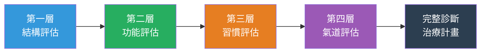
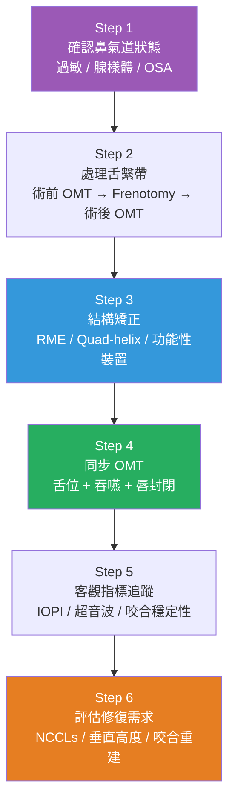

# 口顎功能異常的臨床診斷與整合治療框架

<!-- 註記-META-001：牙醫師/矯正醫師版教學文件，提供「結構—功能—習慣—氣道」四層診斷框架、分齡介入策略、OMT與結構矯正的整合順序，及客觀追蹤指標的臨床應用 -->

> **文件版本**：v1.0
> **建立日期**：2026-04-14
> **目標讀者**：牙醫師、矯正醫師、兒童牙科醫師
> **狀態**：draft

---

## 大綱與摘要

<!-- 註記-SEC-001 -->

### 文件大綱

| 章節 | 主題 | 臨床重點 |
|:----:|------|---------|
| 一 | 核心臨床概念 | 功能失衡是結構問題的源頭，不是反之 |
| 二 | 四層診斷框架 | 結構—功能—習慣—氣道的系統性評估 |
| 三 | 分齡介入策略 | 不同年齡段的最佳介入窗口與裝置選擇 |
| 四 | OMT 的正確定位 | 不是「做操」，是神經肌肉功能重建 |
| 五 | 治療順序的關鍵原則 | 錯的順序會導致復發 |
| 六 | 客觀追蹤指標 | 超越「看牙齒排不排整齊」的評估維度 |
| 七 | 多學科轉介時機 | 何時需要耳鼻喉科、語言治療師、睡眠科 |

<!-- 註記-TBL-001：文件大綱表 -->

### 摘要

<!-- 註記-SUM-001 -->
口顎功能異常的臨床核心是「功能刺激不足 → 顎骨發育偏移 → 咬合與氣道障礙表型」的連鎖邏輯。診斷應採「結構—功能—習慣—氣道」四層評估，治療順序為：氣道確認 → 結構矯正 → OMT → 客觀指標追蹤，任何層次的忽略都會造成復發。

---

## 一、核心臨床概念：功能失衡是結構問題的源頭

<!-- 註記-SEC-002 -->

傳統矯正的思維是：**「牙齒排不整齊 → 矯正排列 → 完成」**。

但這份資料的整合提示了一個更根本的邏輯：

**功能失衡（口呼吸、逆吞嚥、低舌位、咀嚼不足）→ 顎骨發育偏移 → 咬合與氣道障礙表型**

這條因果鏈意味著：只做排齒，不處理功能來源，**復發是必然的，不是例外。**

### 功能異常與結構表型的對應

| 功能異常 | 直接結構影響 | 下游臨床表型 |
|---------|------------|------------|
| **口呼吸** | 舌頭低位 → 上顎失去側向擴張刺激 | 上顎狹窄、高拱顎、前牙唇傾 |
| **逆吞嚥** | 舌頭往前推 → 唇周肌異常代償（7.4 倍應力） | 前牙開咬、後牙反咬合、齒頸磨耗 |
| **低舌位** | 上顎無持續擴張力 | 上顎弓橫向縮窄、鼻腔容積縮小 |
| **咀嚼不足** | 顎骨功能性刺激不足 | 齒弓空間不足、臼齒萌出異常 |
| **舌繫帶沾黏** | 舌尖無法上抬 → 無法形成正確吞嚥波形 | 逆吞嚥強化、上顎弓橫向發育受限 |

<!-- 註記-TBL-002：功能異常與結構表型對應表 -->

> [!important] 矯正醫師是 OSA 的第一線篩查者
> AAO 2026 白皮書明確定位：矯正醫師不只是排列牙齒的技術執行者，而是口顎功能異常與睡眠呼吸障礙的第一線辨識者與多學科治療協調者。

---

## 二、四層診斷框架：結構—功能—習慣—氣道

<!-- 註記-SEC-003 -->

建議在初診時依序評估以下四層，每層不評估完整，治療計畫就是不完整的：

<!-- 註記-FLW-001：四層診斷評估流程圖 -->

### 第一層：結構評估

| 評估項目 | 觀察重點 | 工具 |
|---------|---------|------|
| **上顎骨** | 橫向寬度、顎頂高度 | 研究模型、CBCT |
| **下顎** | 下顎平面角、後縮程度 | 頭顱側位片（Ceph） |
| **舌繫帶** | 舌尖上抬幅度、功能性受限程度 | Kotlow / Hazelbaker 分類 |
| **鼻腔** | 鼻腔容積、鼻中隔偏曲 | CBCT 氣道分析 |
| **咽喉腔** | 鼻咽、口咽氣道體積 | CBCT 氣道分析 |

<!-- 註記-TBL-003：結構評估項目與工具表 -->

### 第二層：功能評估

| 評估項目 | 觀察重點 | 工具 |
|---------|---------|------|
| **吞嚥模式** | 舌頭是否往前推、嘴唇是否過度收縮 | 臨床視診、sEMG |
| **舌位靜止位** | 靜止閉口時舌頭是否自然貼上顎 | 臨床視診 |
| **舌壓** | 前置與後置舌壓 | IOPI |
| **咀嚼模式** | 側化比例、咀嚼效率 | 咀嚼評估量表 |
| **舌骨位置** | 靜止位前移量 | 超音波 B-mode |

<!-- 註記-TBL-004：功能評估項目與工具表 -->

### 第三層：習慣評估

| 評估項目 | 問診重點 |
|---------|---------|
| 飲食習慣 | 奶瓶使用時間、食物質地偏好、sippy cup 使用 |
| 非營養性吸吮 | 拇指吸吮、奶嘴使用至幾歲 |
| 呼吸習慣 | 白天嘴唇開合狀態、睡眠姿勢 |
| 飲水方式 | 是否需要水才能吞下食物 |

<!-- 註記-TBL-005：習慣評估問診清單 -->

### 第四層：氣道評估

| 評估項目 | 工具 | 轉介時機 |
|---------|------|---------|
| 鼻氣道阻塞 | 問診 + 鼻呼吸測試 | 症狀明顯 → 耳鼻喉科 |
| 腺樣體/扁桃腺 | 視診 / CBCT | 氣道嚴重受阻 → 耳鼻喉科 |
| 睡眠呼吸中止 | OSA 篩查問卷（PedOSA-18） | 篩查陽性 → 睡眠科 PSG |
| 睡眠磨牙 | 家長問診 + 磨耗評估 | 嚴重磨耗 + OSA 懷疑 → 睡眠科 |

<!-- 註記-TBL-006：氣道評估與轉介時機表 -->

---

## 三、分齡介入策略

<!-- 註記-SEC-004 -->

| 年齡段 | 骨骼狀態 | 優先介入 | 主要裝置 |
|-------|---------|---------|---------|
| **0–3 歲** | 高可塑性 | 舌繫帶評估、飲食引導、鼻氣道篩查 | — |
| **3–6 歲** | 高可塑性 | 口呼吸處理、早期 OMT 建立舌位 | — |
| **6–10 歲** | **最佳矯正期** | RME 或 Quad-helix + OMT 同步介入 | Quad-helix / RME / U-bow activator |
| **10–16 歲** | 生長高峰期 | 下顎前導裝置、持續 OMT | Herbst / Twin Block / 功能性裝置 |
| **成人** | 骨化完成 | MARPE、Frenotomy + DISE、咬合重建 | MARPE / 手術矯正 |

<!-- 註記-TBL-007：分齡介入策略與裝置選擇表 -->

**關鍵時機窗口（6–10 歲）的證據：**
- Quad-helix 後牙反咬合矯正成功率 413/1000（OR = 50.59），GRADE 高等級
- RME 對睡眠磨牙改善顯著（p = 0.006）
- 乳牙列末期搭配 U-bow activator，可在三維方向誘導上顎骨再生長
- 上顎前牽對 OSA 兒童：AHI 下降 45%（一項研究報告）

---

## 四、OMT 的正確臨床定位

<!-- 註記-SEC-005 -->

> [!important] OMT 不是「叫病人努力做動作」
> 口腔肌功能治療（OMT / FuCT）的本質是**神經肌肉功能重建**：重建舌頭的靜止位、吞嚥時序、唇封閉模式，並降低代償肌群（mentalis、SCM、顳肌）的異常靜止張力。

### OMT 的核心訓練目標

| 訓練項目 | 目標 | 機制 |
|---------|------|------|
| **舌尖上抬強化** | 建立正確舌位靜止位 | 讓舌頭可以持續對上顎提供擴張刺激 |
| **吞嚥時序重建** | 舌頭由前往後蠕動而非往前推 | 改變逆吞嚥的運動程式 |
| **唇封閉訓練** | 降低 mentalis 過度代償張力 | 減少齒頸部異常應力 |
| **鼻呼吸強化** | 建立正確呼吸模式 | 與氣道處理同步，互相強化 |

<!-- 註記-TBL-008：OMT 核心訓練目標與機制表 -->

### OMT 療效數據

| 研究族群 | OMT 方案 | 療效 |
|---------|---------|------|
| 逆吞嚥兒童 | 8 週每週訓練 | **47% 恢復正常吞嚥模式** |
| 逆吞嚥兒童 + Bionator | 合併裝置 | **62% 恢復正常吞嚥模式** |
| OSA 兒童 | Meta 分析 | AHI 顯著降低、血氧飽和度改善 |
| OMT 先於固定矯正 | 對照組 | 開咬矯正效果多 **0.6 mm**，穩定性更佳 |

<!-- 註記-TBL-009：OMT 臨床療效數據彙整表 -->

---

## 五、治療順序的關鍵原則

<!-- 註記-SEC-006 -->

**錯的順序 = 復發**。以下是從學術整合得出的合理治療排序：

<!-- 註記-FLW-002：整合治療順序流程圖 -->

### 三個最常見的順序錯誤

| 錯誤順序 | 後果 |
|---------|------|
| 鼻氣道未處理就做 OMT | 舌頭低位無法改善，OMT 效果大打折扣 |
| 做 RME 但未同步 OMT | 擴張後上顎弓因逆吞嚥持續收縮，復發率高 |
| NCCLs 直接填補，未矯正逆吞嚥 | 填補後繼續磨耗，治標不治本 |

<!-- 註記-TBL-010：常見治療順序錯誤與後果對照表 -->

> [!important] 舌繫帶切開前後都需要 OMT
> 單純 Frenotomy 若無配合 OMT，舌頭的代償動作習慣難以改變。術前 OMT 建立功能動作模式，術後 OMT 鞏固正確吞嚥，兩者缺一不可。

---

## 六、客觀追蹤指標

<!-- 註記-SEC-007 -->

超越「看牙齒排不排整齊」——建立以下客觀指標追蹤系統：

| 評估層次 | 工具 | 關鍵指標 | 臨床閾值 |
|---------|------|---------|---------|
| **肌力層** | IOPI | 後置舌壓（PTS, kPa） | 成人正常值 > 40 kPa |
| **啟動層** | sEMG（FOM 區域） | 靜止期 EMG 振幅 | 正常 < 10 μV（電靜默）；高張力 > 15 μV |
| **運動輸出層** | 超音波舌骨動態 | 最大前移量（ADA, mm） | < 13.5 mm = 高誤吸風險 |
| **牙齒硬組織** | 口內掃描重疊分析 | NCCLs 進展速度 | 每 6 個月比對 |
| **氣道** | PSG + CBCT | AHI、鼻咽氣道容積 | AHI > 5 = 需處理 |

<!-- 註記-TBL-011：客觀追蹤指標系統表 -->

**鑑別診斷：高張力 vs 肌力不足（決定 OMT 方向）**

| 步驟 | 工具 | 高張力表現 | 肌力不足表現 |
|------|------|-----------|-----------|
| Step 1 | 靜止期 sEMG | > 15 μV（持續放電） | < 10 μV（電靜默） |
| Step 2 | IOPI MVC | 接近正常 | **< 30 kPa**（顯著偏低） |
| Step 3 | CCFT 測試 | 差 + 4 週後 SH EMG↓ | 正常 + 訓練後無改善 |
| 治療方向 | — | **CCFET 優先**（改善頸椎對齊） | **TPRT + 高速張口訓練** |

<!-- 註記-TBL-012：高張力 vs 肌力不足鑑別診斷與治療方向表 -->

[補-1] 建議診所建立「院內超音波舌骨前移正常值」資料庫（至少 20–30 名無吞嚥障礙成人），文獻數值跨研究差距高達 2 倍，不可直接套用。

---

## 七、多學科轉介時機

<!-- 註記-SEC-008 -->

| 臨床發現 | 轉介科別 | 轉介優先度 |
|---------|---------|----------|
| 鼻塞、打呼、睡覺張口 | **耳鼻喉科**（過敏評估、腺樣體評估） | 🔴 優先 |
| OSA 篩查陽性（打呼 + 白天嗜睡 + 磨牙） | **睡眠醫學科**（PSG） | 🔴 優先 |
| 吞嚥模式異常、語音問題 | **語言治療師 / 口腔肌功能治療師** | 🟡 同步 |
| 舌繫帶沾黏合併功能受限 | 口腔外科 / 雷射牙科（Frenotomy） | 🟡 同步 |
| 嚴重顎骨發育不良（成人） | **口腔顎面外科**（正顎手術評估） | 🔵 依狀況 |
| 感覺統合障礙、口腔觸覺過敏 | **兒童職能治療師** | 🔵 依狀況 |

<!-- 註記-TBL-013：多學科轉介時機與優先度表 -->

[補-2] 建議診所建立標準化多學科轉介流程表單，記錄轉介原因、回覆結果與後續追蹤，有助於提升整合治療品質並建立研究資料庫。

---

## 重要提示字句彙整

<!-- 註記-SEC-TIPS -->

> [!important] 功能失衡是結構問題的源頭
> 口顎功能異常（口呼吸、逆吞嚥、低舌位）是顎骨發育偏移的原因，排齒不處理功能，復發是必然的。

> [!important] 矯正醫師是 OSA 第一線篩查者
> AAO 2026：矯正醫師應主動篩查 OSA，協調多學科治療，不只是排列牙齒。

> [!important] OMT 是神經肌肉功能重建，不是體操
> OMT 的本質是重建吞嚥時序與肌肉靜止張力，必須搭配結構矯正才能有穩定療效。

> [!important] 氣道確認是所有治療的前提
> 鼻氣道未通暢時啟動 OMT，效果大幅受限。先通氣，再訓練。

> [!important] NCCLs 先矯正逆吞嚥，再評估修復
> 7.4 倍的逆吞嚥應力每天 1,000 次累積——填補前不矯正病因，填補物終將磨損殆盡。

---

## 建議補充註記

[補-1] 建議診所建立院內超音波舌骨前移正常值資料庫（n ≥ 20），不可直接套用文獻閾值（跨研究差距達 2 倍）。

[補-2] 建議建立標準化多學科轉介流程表單，提升整合治療品質並累積研究資料。

[補-3] 舌繫帶分級建議採用固定分類工具（推薦 Kotlow 或 Hazelbaker），並在病歷中記錄，有助於未來參與多中心研究。

---

#AI圖片提示詞開始#
主題：口顎功能異常四層診斷框架臨床海報
風格：專業臨床診所教育海報風
描述：A clean clinical reference poster showing the four-layer diagnostic framework for orofacial myofunctional disorders. Four horizontal layers stacked vertically: Layer 1 (blue) "結構層 Structure" showing icons of palatal arch, mandible, tongue tie; Layer 2 (green) "功能層 Function" showing IOPI device, sEMG electrodes, hyoid ultrasound; Layer 3 (orange) "習慣層 Habits" showing sippy cup, thumb sucking, soft food icons; Layer 4 (purple) "氣道層 Airway" showing nasal cavity, adenoids, sleep study. Right side shows treatment sequence: Step 1→6 with arrows. Professional clinic poster style, landscape orientation, clean sans-serif typography, suitable for display in treatment room.
尺寸建議：16:9 橫向
#AI圖片提示詞結束#

<!-- 註記-IMG-001：四層診斷框架臨床參考海報 -->

---

> **延伸閱讀**：[[TEACH-01_一般民眾版]] | [[TEACH-03_學術研究者版]] | [[MASTER_口顎功能異常多系統影響整合報告]]
