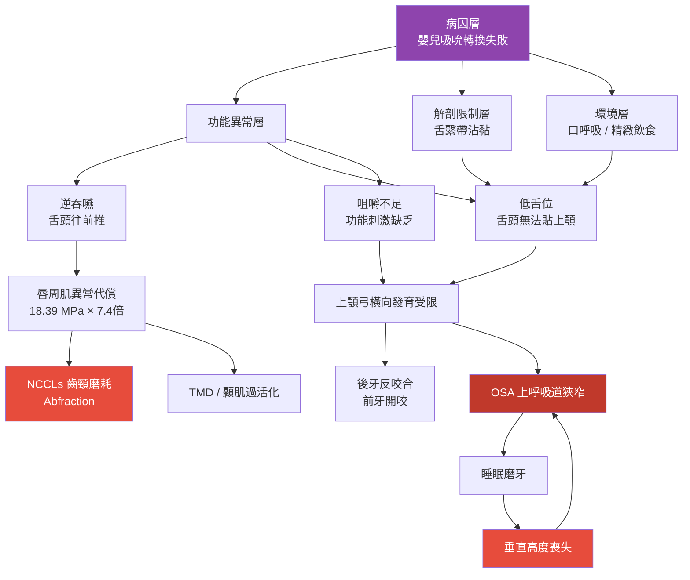
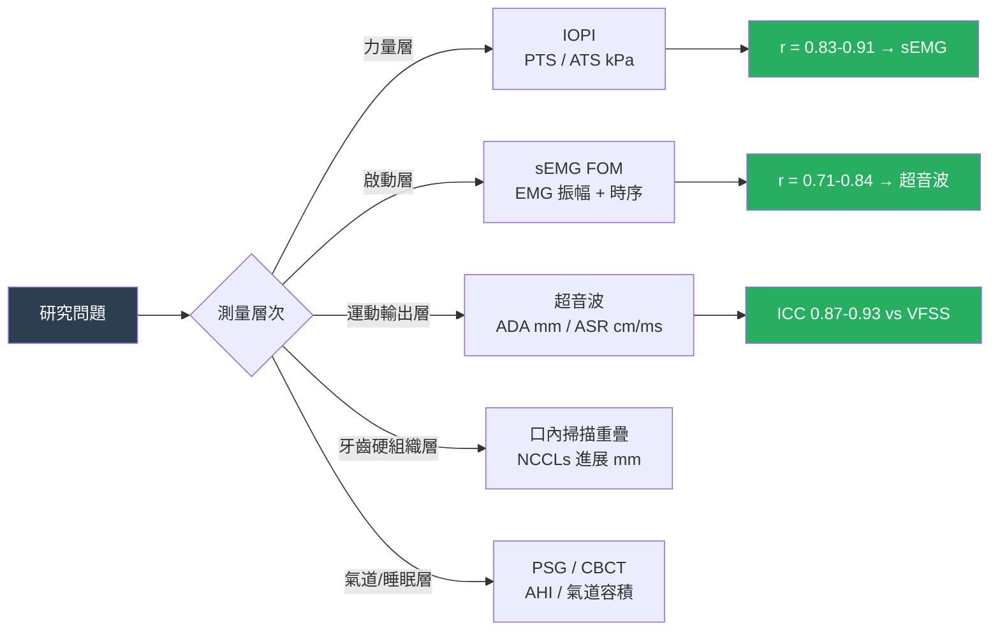

# 口顎功能異常的多系統影響：學術研究架構與可發展命題

<!-- 註記-META-001：牙醫學術研究者版教學文件，提供完整的理論模型、研究變項分層架構、現有文獻的知識缺口分析，以及可直接發展為論文的研究命題清單 -->

> **文件版本**：v1.0
> **建立日期**：2026-04-14
> **目標讀者**：牙醫學術研究者、研究生、臨床研究設計者
> **狀態**：draft — 待 SciSpace / Elicit / Consensus 文獻查詢補強

---

## 大綱與摘要

<!-- 註記-SEC-001 -->

### 文件大綱

| 章節 | 主題 | 學術重點 |
|:----:|------|---------|
| 一 | 整合理論模型 | 功能刺激不足 → 顎骨發育偏移 → 多系統表型的因果鏈 |
| 二 | 研究變項分層架構 | 結構/功能/行為/介入四層變項的操作化定義 |
| 三 | 現有文獻的知識缺口 | 哪些假說尚缺直接臨床縱貫研究 |
| 四 | 可發展的研究命題 | 10 個可直接寫成論文的研究題目 |
| 五 | 方法論建議 | 量化指標選擇、研究設計強度、跨科合作框架 |
| 六 | 原創研究方向精華 | 最具發表潛力的 3 個優先命題 |

<!-- 註記-TBL-001：文件大綱表 -->

### 摘要

<!-- 註記-SUM-001 -->
口顎功能異常研究的整合理論模型可收斂為「功能刺激不足 → 舌位/咀嚼/吞嚥異常 → 顎骨與氣道發育偏移 → 咬合與睡眠呼吸障礙表型」。現有文獻最大缺口在於缺乏縱貫性研究直接驗證「矯正逆吞嚥後 NCCLs 進展減緩」，以及以超音波客觀量化乾食吞嚥訓練的療效追蹤。

---

## 一、整合理論模型

<!-- 註記-SEC-002 -->

### 核心因果鏈

<!-- 註記-FLW-001：口顎功能異常多系統影響因果模型圖 -->

### 三個可研究的子問題

從整合模型中，可分離出三個相對獨立的可研究子問題：

| 子問題 | 核心命題 | 現有證據強度 |
|-------|---------|------------|
| **機械刺激 → 顎骨表型** | 功能刺激（舌位、咀嚼力、氣流）對顎骨生長的量化因果關係 | 有 FEA 與相關研究，缺縱貫 RCT |
| **舌骨動力學 → 吞嚥安全** | 舌骨前移量/速度與誤吸風險的量化閾值及訓練反應 | 有橫斷面閾值研究，缺訓練介入縱貫資料 |
| **OMT/矯正 → 長期穩定性** | 不同介入序列對咬合穩定性、NCCLs 進展、OSA 的長期效果比較 | 缺高品質 RCT，多為案例系列 |

<!-- 註記-TBL-002：三個核心子問題的現有證據強度表 -->

---

## 二、研究變項分層架構

<!-- 註記-SEC-003 -->

依知識管理原則，本研究領域的變項可操作化為以下四層：

### 第一層：結構變項（Structure Variables）

| 變項 | 操作化測量 | 工具 | 可量化單位 |
|------|----------|------|---------|
| 上顎橫向寬度 | 第一大臼齒間距 | 研究模型 / CBCT | mm |
| 顎穹窿高度 | 中切牙到第一臼齒連線的高度 | 研究模型 / CBCT | mm |
| 下顎平面角（SN-MP） | Ceph 測量 | 頭顱側位片 | 度（°） |
| 舌骨靜止位 | 靜止位與 C4 椎體的相對位置 | 超音波 / Ceph | mm |
| 鼻咽/口咽氣道容積 | 三維氣道體積 | CBCT | mm³ |
| 後牙反咬合程度 | 覆蓋量 | 研究模型 | mm |

<!-- 註記-TBL-003：結構變項操作化測量表 -->

### 第二層：功能變項（Functional Variables）

| 變項 | 操作化測量 | 工具 | 可量化單位 |
|------|----------|------|---------|
| 前置舌壓（ATS） | Iowa Oral Performance Instrument | IOPI | kPa |
| 後置舌壓（PTS） | Iowa Oral Performance Instrument | IOPI | kPa |
| 舌骨最大前移量（ADA） | 靜止位至最大前移位的水平距離 | 超音波 B-mode | mm |
| 舌骨前移速度（ASR） | ADA / 總移動時間 | 超音波 | cm/ms |
| 舌骨上肌群 EMG 靜止張力 | 靜止期 RMS 振幅 | sEMG | μV |
| 吞嚥型態 | 正常/逆吞嚥的型態分類 | 臨床視診 + sEMG | 類別 |
| 咀嚼效率 | 15 次咀嚼後的食物粉碎程度 | 咀嚼顆粒篩析 | 顆粒分布 |
| 深頸屈肌功能（CCFT） | 顱頸屈曲測試達到的壓力水準 | 穩定壓力儀 | mmHg |

<!-- 註記-TBL-004：功能變項操作化測量表 -->

### 第三層：行為變項（Behavioral Variables）

| 變項 | 操作化測量 |
|------|----------|
| 食物質地偏好 | 飲食日誌評分（軟食/硬食比例） |
| 咀嚼側化比例 | 偏側咀嚼 vs 雙側交替 |
| 口呼吸比例 | 日間嘴唇閉合觀察 / 夜間錄影 |
| 非營養性吸吮 | 習慣問卷（奶嘴/拇指/咬東西） |
| 吞嚥費力感 | 主觀費力感量表（0–10） |

<!-- 註記-TBL-005：行為變項操作化測量表 -->

### 第四層：介入變項（Intervention Variables）

| 介入 | 操作化定義 | 主要測量結果 |
|------|----------|------------|
| 快速上顎擴張（RME） | 裝置類型、擴張速率、總擴張量（mm） | 鼻腔氣道阻力、AHI、磨牙改善率 |
| 口腔肌功能治療（OMT） | 訓練頻率（次/週）、訓練時間（週）、訓練內容 | 舌壓、舌骨位移、吞嚥型態 |
| 舌繫帶切開術（Frenotomy） | 術式類型（剪開 / 雷射 / Z-plasty）、術前術後 OMT | 舌尖上抬幅度、吞嚥型態 |
| 功能性咀嚼訓練 | 食物質地、訓練時間（分/天）、追蹤時間 | 咀嚼效率、顎骨寬度、舌位 |
| 深頸屈肌訓練（CCFET） | 訓練強度（% MVC）、訓練頻率、訓練週數 | SH EMG 振幅、舌骨前移量 |

<!-- 註記-TBL-006：介入變項操作化定義表 -->

---

## 三、現有文獻的知識缺口

<!-- 註記-SEC-004 -->

以下依缺口重要性排列，標示現有最強文獻與尚缺的研究類型：

| # | 研究缺口 | 現有最強文獻 | 缺乏的研究類型 | 重要性 |
|---|---------|------------|--------------|-------|
| 1 | **逆吞嚥矯正後 NCCLs 進展減緩** | 2023 FEA（機制模擬） | 縱貫 RCT（NCCLs 深度 vs OMT 前後） | 🔴 最高 |
| 2 | **OMT 對 NCCLs 的直接介入效果** | 無直接研究 | 前瞻性 RCT | 🔴 最高 |
| 3 | **舌繫帶沾黏 → OSA 的直接因果** | Meta 分析（OR = 3.05） | 高品質縱貫 RCT（Frenotomy → AHI 追蹤） | 🔴 高 |
| 4 | **乾食吞嚥訓練的客觀量化追蹤** | 無 | 超音波舌骨追蹤 × 乾食訓練 RCT | 🟡 高 |
| 5 | **DCF 訓練對逆吞嚥族群的效果** | 2012 健康受試者研究（n=45） | 逆吞嚥患者介入研究 | 🟡 中 |
| 6 | **OMT 先行 vs 同步 vs 後行矯正的穩定性比較** | 案例研究（0.6 mm 差異） | 三臂 RCT | 🟡 中 |
| 7 | **超音波作為 OMT 成效即時回饋工具** | 2025 同步 VFSS 驗證（r=0.91） | 臨床可行性 + 成本效益研究 | 🔵 中 |

<!-- 註記-TBL-007：知識缺口重要性排列表 -->

> [!important] 最重要的原創研究機會
> 「逆吞嚥矯正前後 NCCLs 進展速度的縱貫比較」目前全球幾乎無直接臨床研究，是最具學術發表潛力的原創方向。

---

## 四、可發展的研究命題

<!-- 註記-SEC-005 -->

以下 10 個命題均有充足的文獻背景支撐，且對應知識缺口，可直接作為論文或臨床研究計畫的核心命題：

| # | 研究命題 | 研究設計建議 | 主要結果指標 |
|---|---------|------------|------------|
| **R-01** | 逆吞嚥患者接受 OMT 介入後，NCCLs 進展速度是否顯著減緩？ | 前瞻性 RCT（6 個月追蹤） | NCCLs 深度進展量（口內掃描重疊分析） |
| **R-02** | 兒童逆吞嚥患者中，IOPI 後置舌壓與超音波舌骨前移量的相關性如何？ | 橫斷面相關研究 | 相關係數（r）、路徑分析 |
| **R-03** | 高拱顎兒童在 RME 前後，吞嚥型態與舌位如何變化？ | 前後測設計（RCT 或配對研究） | 吞嚥型態分類、IOPI、超音波 ADA |
| **R-04** | OMT 先於 vs 同步 vs 後於固定矯正，哪種順序的咬合穩定性最佳？ | 三臂 RCT（2 年追蹤） | 開咬矯正量、後牙反咬合復發率 |
| **R-05** | 舌繫帶沾黏釋放（Frenotomy）合併 OMT，對舌位與吞嚥效率的增益效果為何？ | RCT（Frenotomy only vs Frenotomy + OMT） | 舌尖上抬幅度、IOPI、吞嚥型態 |
| **R-06** | 以超音波舌骨位移量化追蹤乾食吞嚥訓練的即時療效：可行性研究 | 前瞻性可行性研究 | ADA 訓練前後差值 > 2 mm（即時效應閾值） |
| **R-07** | 深頸屈肌訓練（CCFET）對逆吞嚥兒童的舌骨上肌群 EMG 靜止張力與吞嚥時序的影響 | RCT（4 週訓練，前後測 + 追蹤） | SH EMG 靜止振幅、舌骨前移速度 |
| **R-08** | 靜止期 sEMG + IOPI 三步驟鑑別流程，對高張力 vs 肌力不足的診斷一致性研究 | 診斷性研究（Kappa 係數） | 分類一致性（Kappa）、治療反應預測效度 |
| **R-09** | 口呼吸兒童接受鼻氣道介入後，舌位自動回正的時間動態分析 | 前瞻性觀察研究 | 舌位靜止位（超音波）、IOPI、吞嚥型態 |
| **R-10** | 功能性咀嚼訓練對混合齒列期兒童上顎橫向寬度的長期影響 | 前瞻性 RCT（12 個月追蹤） | 第一大臼齒間距、咀嚼效率、舌壓 |

<!-- 註記-TBL-008：可發展研究命題一覽表 -->

---

## 五、方法論建議

<!-- 註記-SEC-006 -->

### 量化指標的選擇邏輯

以下為建立研究設計時，選擇量化指標的決策框架：

<!-- 註記-FLW-002：量化指標選擇決策框架圖 -->

### 研究設計強度建議

| 研究類型 | GRADE 證據等級 | 適用命題 | 建議最小樣本數 |
|---------|-------------|---------|-------------|
| 系統性回顧 + Meta 分析 | A | R-03、R-04、R-05 | —（依納入研究數） |
| RCT（隨機對照試驗） | A | R-01、R-04、R-05、R-07、R-10 | n ≥ 30/組（計算需 power analysis） |
| 前瞻性配對研究 | B | R-03、R-06、R-09 | n ≥ 20/組 |
| 診斷性研究 | B | R-02、R-08 | n ≥ 50（ROC 分析需求） |
| 可行性研究 | C | R-06 | n ≥ 10（探索性） |

<!-- 註記-TBL-009：研究設計強度與適用命題表 -->

### 院內正常值資料庫的必要性

**重要方法論警告**：

以下文獻數值跨研究差距過大，**不可直接套用於研究設計中作為閾值**，必須先建立院內正常值：

| 指標 | 文獻範圍 | 差距原因 | 建議 |
|------|---------|---------|------|
| 舌骨最大前移量 | 8.4–17.3 mm | 測量基準點不統一 | 建立院內 normative data（n ≥ 20） |
| IOPI 成人正常值 | 30–60 kPa（前置） | 年齡、性別差異大 | 依年齡性別分層建立 |
| SH EMG 靜止基線 | 因設備差異大 | 電極種類、位置不同 | 固定設備與協定 |

<!-- 註記-TBL-010：文獻閾值不可直接套用的警告表 -->

[補-1] 建議在第一個研究計畫啟動前，先執行「院內正常值建立研究」（n = 20–30 名無吞嚥障礙健康成人），建立 IOPI、超音波 ADA/ASR、sEMG 靜止基線的院內參考值，這本身也可作為方法論驗證論文發表。

---

## 六、原創研究方向精華：最具發表潛力的 3 個優先命題

<!-- 註記-SEC-007 -->

### 🥇 第一優先：R-01 — 逆吞嚥矯正與 NCCLs 進展

**為什麼最重要**：
目前全球文獻中，將「矯正逆吞嚥」與「NCCLs 進展速度」直接連結的縱貫性臨床研究，幾乎不存在。FEA 研究已提供機制數據（7.4 倍應力差異），但缺乏臨床縱貫驗證——這是機制研究到臨床應用的最關鍵缺口。

**研究設計精華**：
- **族群**：成人逆吞嚥患者，有 NCCLs 但尚未修復
- **分組**：OMT 介入組 vs 對照組（6 個月追蹤）
- **主要指標**：口內掃描重疊分析的 NCCLs 深度進展量（μm）
- **次要指標**：IOPI 後置舌壓、吞嚥型態分類、唇壓測量
- **預期貢獻**：首篇直接以臨床縱貫數據驗證逆吞嚥 → NCCLs 因果鏈的研究

### 🥈 第二優先：R-06 — 超音波追蹤乾食吞嚥訓練

**為什麼重要**：
將超音波舌骨即時追蹤（SiamFC，175 fps，98.9% 精確度）與「乾食吞嚥訓練」結合，可建立全球第一個針對乾食吞嚥訓練效果的客觀量化追蹤資料庫——完全無輻射、診所可執行、可即時生物回饋。

**研究設計精華**：
- **族群**：逆吞嚥兒童或成人，接受乾食（餅乾）吞嚥訓練
- **測量工具**：攜帶型超音波 + SiamFC 自動追蹤（PolyU 開源代碼）
- **訓練流程**：訓練前（5 次空吞嚥 ADA 基準值）→ 乾食訓練 → 訓練後（5 次空吞嚥 ADA 再測）
- **成效閾值**：ADA 差值 > 2 mm = 即時效應陽性
- **預期貢獻**：建立無輻射乾食吞嚥訓練客觀評估標準

### 🥉 第三優先：R-08 — 三步驟鑑別診斷的效度驗證

**為什麼重要**：
目前文獻中「高張力 vs 真性肌力不足」的鑑別無標準化臨床流程。建立「靜止期 sEMG → IOPI MVC → CCFT」的三步驟鑑別流程，並驗證其診斷一致性（Kappa）與治療反應預測效度，可直接改變臨床決策品質。

**研究設計精華**：
- **族群**：逆吞嚥合併 TMD 或 FHP 患者
- **分類工具**：靜止期 sEMG + IOPI MVC + CCFT（4 週訓練反應）
- **效度驗證**：診斷一致性（Kappa ≥ 0.6）+ 治療反應預測（OMT 前後 IOPI / 超音波 ADA）
- **預期貢獻**：建立逆吞嚥 OMT 治療選擇的第一個標準化決策工具

---

## 重要提示字句彙整

<!-- 註記-SEC-TIPS -->

> [!important] NCCLs 縱貫研究是最具原創價值的方向
> 「矯正逆吞嚥後 NCCLs 進展速度」的縱貫 RCT，目前全球幾乎空白，是機制研究到臨床應用的最關鍵缺口。

> [!important] 超音波 + 乾食訓練 = 無輻射客觀追蹤新標準
> SiamFC 即時追蹤（98.9% 精確度）× 乾食吞嚥訓練，可建立全球首個客觀量化追蹤資料庫。

> [!important] 必須先建立院內正常值
> 文獻舌骨前移量跨研究差距 2 倍（8.4 vs 17.3 mm），不可直接套用閾值。院內正常值建立研究本身也可獨立發表。

> [!important] IOPI ≠ VFSS 的直接替代
> IOPI 測量靜態肌力容量，VFSS 測量動態運動輸出，構念不同。須以 FOM-EMG 路徑分析才能建立完整因果鏈。

> [!important] 治療序列研究是最被忽視的缺口
> OMT 先行 vs 同步 vs 後行矯正的長期穩定性比較，目前只有案例資料，高品質 RCT 幾乎不存在。

---

## 建議補充註記

[補-1] 建議第一步執行「院內正常值建立研究」（n = 20–30 名健康成人），本身可作為方法論驗證論文獨立發表，同時為後續所有研究奠定量化基礎。

[補-2] R-06（超音波乾食訓練追蹤）建議與香港理工大學（PolyU）吞嚥研究團隊建立合作關係，PolyU 已有 SiamFC 開源代碼與超音波驗證數據，合作可快速提升研究設計品質。

[補-3] R-01（NCCLs 縱貫研究）的口內掃描重疊分析，建議採用 3Shape Dental Desktop 或 GeoMagic Control X 等軟體，可達到 μm 級精度的表面差異分析。

[補-4] 建議在第一個 RCT 啟動前，先進行系統性文獻回顧（透過 SciSpace / Elicit / Consensus 查詢）確認現有證據等級，並完成 PROSPERO 研究方案預先登記，提升日後發表的公信力。

---

#AI圖片提示詞開始#
主題：口顎功能異常多系統影響學術研究架構圖
風格：專業學術期刊插圖風（白底、清晰標示）
描述：A comprehensive academic research framework diagram for a medical journal. Central element: a theoretical model showing the causal chain from "Infant suckling transition failure" through "Oral myofunctional disorders" to "Craniofacial developmental abnormalities" and downstream outcomes (NCCLs, OSA, posterior crossbite, TMD). Surrounding the central model: four quadrants showing (1) Structural variables — CBCT, cephalometric measurements; (2) Functional variables — IOPI device, ultrasound hyoid tracking, sEMG; (3) Behavioral variables — food texture diary, mouth breathing assessment; (4) Intervention variables — RME device, OMT therapy icons, frenotomy procedure. At the bottom: a research gap matrix highlighting the three priority research directions (R-01, R-06, R-08) in red/gold boxes. Clean academic black-and-white with selective color highlights, suitable for journal submission figure.
尺寸建議：1:1 正方形
#AI圖片提示詞結束#

<!-- 註記-IMG-001：學術研究架構全景圖 -->

---

> **延伸閱讀**：[[TEACH-01_一般民眾版]] | [[TEACH-02_牙醫師矯正醫師版]] | [[MASTER_口顎功能異常多系統影響整合報告]] | [[RESEARCH_PROMPTS_醫學文獻CLI查詢指引]]
